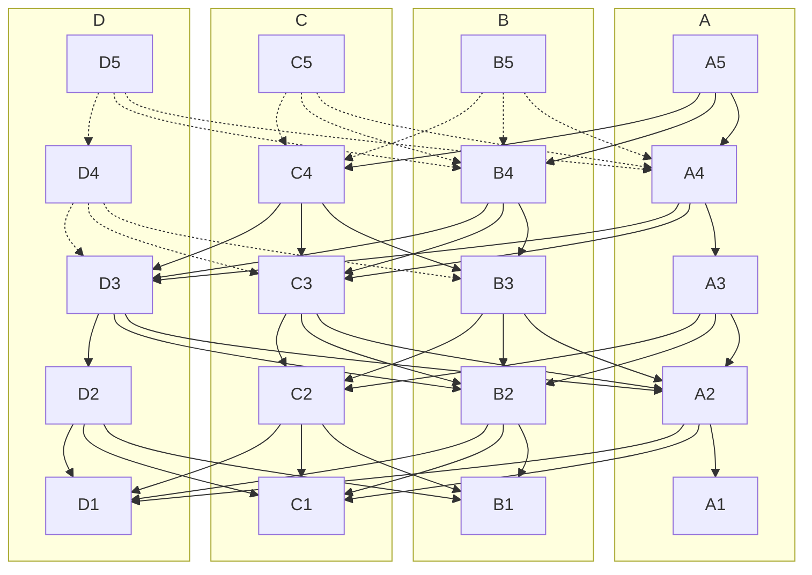

这是对 Mysten Labs 提供的高吞吐量内存池和共识引擎 [Narwhal](https://github.com/MystenLabs/sui/tree/main/narwhal) 和 [Bullshark](https://arxiv.org/abs/2209.05633) 的简要介绍。Sui 默认使用 Narwhal 作为内存池，使用 Bullshark 作为共识引擎，以对需要总排序的事务进行排序，同步验证者之间的事务，并定期检查网络的状态。

这些名字突显了这些组件分担的责任：

- 确保提交给共识的数据的可用性 = [Narwhal](https://arxiv.org/abs/2105.11827)
- 就这些数据达成特定的排序 = [Bullshark](https://dl.acm.org/doi/abs/10.1145/3548606.3559361)

Sui 共识引擎代表了几十年来关于多提议者、高吞吐量共识算法的最新变体，可以实现每秒超过 125,000 笔交易的吞吐量，对于包含 50 个参与方的部署，延迟为两秒，具备生产加密、永久存储和分布式主工作器架构。

Sui 共识引擎方法可以在以下情况下提供显著的可扩展性优势：

- 实验过更大块的区块链，并在执行阶段之前测量了失控的延迟
- 具有快速执行的区块链（例如，专注于交易或具有 UTXO 数据模型），但内存池和共识无法跟上

## 特点

Narwhal 内存池提供：

- 高吞吐量的数据可用性引擎，具有在[主节点](https://github.com/MystenLabs/sui/blob/main/narwhal/primary)处的数据可用性的加密证明
- 用于遍历此信息的结构化图数据结构
- 分配磁盘 I/O 和网络需求的[工作器](https://github.com/MystenLabs/sui/blob/main/narwhal/worker)的扩展架构

[共识](https://github.com/MystenLabs/sui/blob/main/narwhal/consensus)组件提供零消息开销的共识算法，利用图遍历。

## 架构

Narwhal 实例建立了一个消息传递系统，由一组 $3f+1$ 股权单位组成，分布在一组节点之间，并假设一个计算上有界的对手，该对手控制网络并可以腐败持有多达 f 股权单位的参与方。验证者合作形成一个无领导图，其中包含交易的批次 - 文献（在 DAG-based 共识的上下文中）将其指定为 _块_，而 Sui 标记为 _集合_，强调这发生在未指定共识算法使用内存池数据的上下文中。

图的 *顶点* 由经过认证的集合组成。由其验证者作者签署的每个有效集合必须包含一个回合数，并且必须由验证者股权的四分之三（2f+1）签署。这 2f+1 个签名称为 _可用性证书_。此外，该集合必须包含指向上一轮的有效证书的四分之三的哈希指针（即具有 2f + 1 股权单位的验证者的证书），这构成了图的 *边*。

每个集合是以以下方式形成的：每个验证者都 _可靠地广播_ 了每一轮的集合。在指定的有效条件下，如果具有 2f + 1 股权的验证者接收到一个集合，他们将用各自的签名确认它。 2f + 1 个验证者的签名形成一个可用性证书，然后在第 r + 1 轮共享并可能包含在该轮的集合中。

以下图表示了构建这样一个 DAG 的五轮过程（1 到 5），参与其中的权威为 A、B、C 和 D。为简单起见，每个验证者持有 1 股权单位。A5 最新一轮中由 A 明确承认的集合在图中以实线表示。

## 工作原理

* 图的构建允许在每个权威和每轮中将更多的交易插入系统。
* 证书证明了每个集合或块在每轮的数据可用性。
* 它们的内容构成了一个在每个诚实节点上可以以相同方式遍历的 DAG。

## 依赖关系

Narwhal 使用 [Tokio](https://github.com/tokio-rs/tokio)、[RocksDB](https://github.com/facebook/rocksdb/) 和在 [fastcrypto](https://github.com/MystenLabs/fastcrypto) 中实现的通用加密。

## 配置

要进行 Sui 共识引擎的全新部署，请按照 [Running Benchmarks](https://github.com/MystenLabs/sui/blob/main/narwhal/benchmark) 中的说明操作。

## 进一步阅读

Narwhal 和 Tusk（Danezis 等人，2021）是一种利用有向无环图（DAG）的共识系统。基于 DAG 的共识在过去的 30 年里得到了发展，其中一些历史总结在（Wang 等人，2020）中。Narwhal 和 Tusk 的理论祖先是 DAG-Rider（Keidar 等人，2021）。

Narwhal 和 Tusk 采用 [异步模型](https://decentralizedthoughts.github.io/2019-06-01-2019-5-31-models/) 进行开发。Narwhal 和 Tusk 的部分同步变体称为 Bullshark（Spiegelman 等人，2022）。

Narwhal 和 Tusk 最初是在 Facebook Novi 作为 [研究原型](https://github.com/facebookresearch/narwhal) 开发的。

[Bullshark: DAG BFT Protocols Made Practical](https://arxiv.org/pdf/2201.05677.pdf) - 
Bullshark 取代了 Tusk，性能更优。

[Bullshark: The Partially Synchronous Version](https://arxiv.org/pdf/2209.05633.pdf) - 
Bullshark 的简化版本，是今天 Sui 中使用的版本。

[DAG Meets BFT - The Next Generation of BFT Consensus](https://decentralizedthoughts.github.io/2022-06-28-DAG-meets-BFT/) - 解释了 Sui 使用的共识协议的演变。

## 参考文献

 * Danezis, G., Kogias, E. K., Sonnino, A., & Spiegelman, A. (2021). Narwhal and Tusk: A DAG-based Mempool and Efficient BFT Consensus. ArXiv:2105.11827 [Cs]. http://arxiv.org/abs/2105.11827
 * Spiegelman, A., Giridharan, N., Sonnino, A., & Kokoris-Kogias, L. (2022). Bullshark: DAG BFT Protocols Made Practical. ArXiv:2201.05677 [Cs]. https://dl.acm.org/doi/abs/10.1145/3548606.3559361
 * Spiegelman, A., Giridharan, N., Sonnino, A., & Kokoris-Kogias, L. (2022). Bullshark: The Partially Synchronous Version. ArXiv:2209.05633 [Cs]. https://arxiv.org/abs/2209.05633
 * Keidar, I., Kokoris-Kogias, E., Naor, O., & Spiegelman, A. (2021). All You Need is DAG. ArXiv:2102.08325 [Cs]. http://arxiv.org/abs/2102.08325
 * Wang, Q., Yu, J., Chen, S., & Xiang, Y. (2020). SoK: Diving into DAG-based Blockchain Systems. ArXiv:2012.06128 [Cs]. http://arxiv.org/abs/2012.06128
