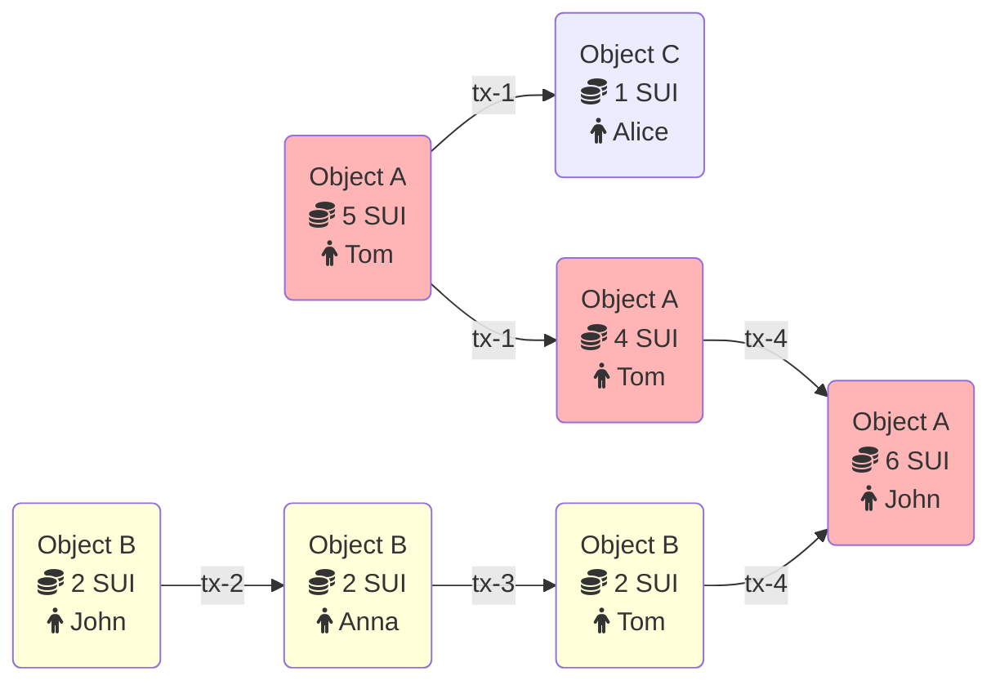

所有对 Sui 数据库的更新都通过交易进行。本主题描述了 Sui 支持的交易类型，并解释了它们的执行方式如何改变账本。Sui 仅有两种类型的交易：

- 可编程交易块，任何人都可以在网络上提交。有关这些交易的信息，请参阅 [可编程交易块](./transactions/prog-txn-blocks.mdx)。
- 系统交易，只有验证者可以直接提交，并负责维护网络运行（更改纪元、启动检查点等）。

## 交易元数据

所有 Sui 交易都具有以下常见元数据：

- **发件人地址：** 发送此交易的用户的 [地址](guides/developer/getting-started/get-address.mdx)。
- **燃气输入：** 一个对象引用，指向将用于支付此交易执行和存储的对象。该对象必须由用户拥有，并且必须是类型为 `sui::coin::Coin<SUI>` 的对象（即 Sui 本地货币）。
- **燃气价格：** 一个无符号整数，指定此交易将支付的每个燃气单位的本地代币数量。燃气价格必须始终非零。
- **最大燃气预算：** 执行此交易时可以支出的最大燃气单位数。如果超过此预算，交易执行将中止，并且除了从燃气输入对象扣除燃气之外，将不产生任何效果。因此，燃气输入对象的价值必须高于燃气价格乘以最大燃气的乘积，而此乘积是燃气输入对象将为交易扣除的最大金额。
- **纪元：** 此交易面向的 Sui 纪元。
- **类型：** 调用、发布或本地事务及其类型特定数据（见下文）。
- **验证器：** 一个密码签名和一个公钥，两者都能对签名进行验证，并由发件人地址在密码上承认。
- **到期：** 设置截止日期后，验证者将不再考虑此交易为有效。可选的到期纪元引用使用户能够定义在一定时间内执行和提交交易（当前纪元小于或等于到期纪元），或在截止日期过后永远不执行的交易。默认情况下，交易无需执行截止日期。

## 交易流程 - 示例

以下是一个示例，展示了在 Sui 中对象和交易是如何相互连接的。

在以下示例中有两个对象：
- 对象 A 是类型为 SUI 的硬币，总余额为 5 SUI
- 对象 B 拥有 2 SUI 硬币，属于 John

Tom 决定将 1 SUI 硬币发送给 Alice。在这种情况下，对象 A 是此交易的输入，从该对象中扣除了 1 SUI 硬币。交易的输出是两个对象：
- 对象 A 具有 4 SUI 硬币，仍然属于 Tom
- 新创建的对象 C 具有 1 SUI 硬币，现在属于 Alice

与此同时，John 决定将 2 SUI 硬币发送给 Anna。由于对象与交易之间的关系是以有向无环图（DAG）的形式编写的，并且两个交易与不同的对象交互，因此此交易与将硬币从 Tom 发送给 Alice 的交易并行执行。此交易仅更改对象 B 的所有者，从 John 更改为 Anna。

收到 2 SUI 硬币后，Anna 立即将其发送给 Tom。现在，Tom 有 6 SUI 硬币（来自对象 A 的 4 个和对象 B 的 2 个）。

最后，Tom 将他所有的 SUI 硬币发送给 John。对于此交易，输入实际上是两个对象（对象 A 和对象 B）。对象 B 被销毁，并将其值添加到对象 A 中。结果，交易的输出仅为具有 6 SUI 的对象 A。

## 交易、对象和数据的限制

Sui 对交易和交易中使用的数据有一些限制，例如最大大小和使用的对象数量。要查看源代码中的完整限制列表，请参阅 [Transaction input limits](https://github.com/MystenLabs/sui/blob/main/crates/sui-protocol-config/src/lib.rs#L154)。

