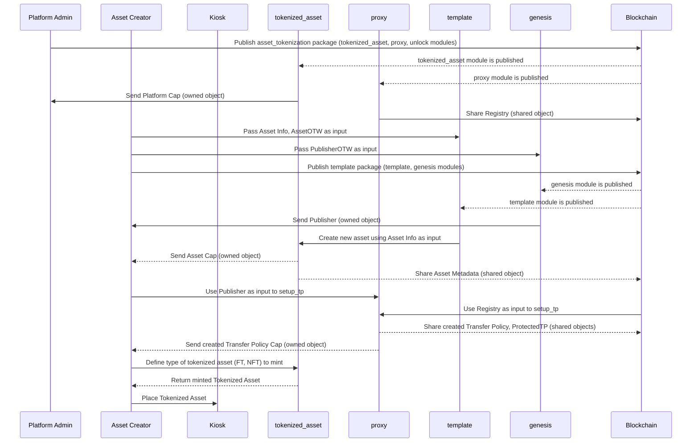
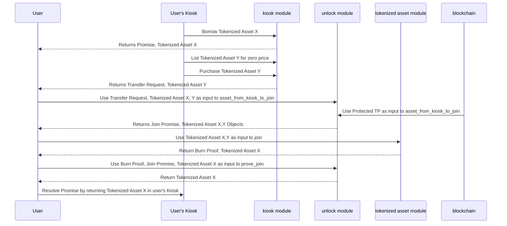
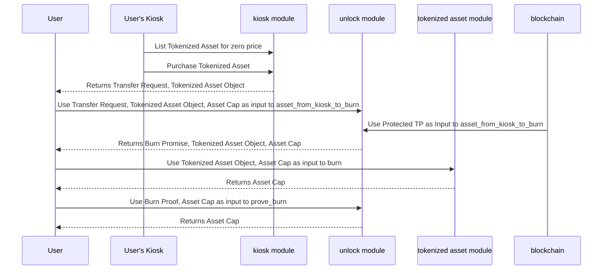

import TabItem from '@theme/TabItem';
import Tabs from '@theme/Tabs';

资产代币化是指将现实世界的资产（如房地产、艺术品、大宗商品、股票或其他有价值的资产）表示为区块链网络上的数字代币的过程。这涉及将资产的所有权或权利转换为数字代币，然后在区块链上记录和管理这些代币。

## 高层次概述

该概念是将高价值资产分割成更小、更经济实惠的单位，代表资产的所有权或资产的一部分。

这种策略使得更多的投资者能够参与，他们可能希望通过投资于数字资产的一部分来降低风险，而不是成为唯一的所有者，从而扩大了对更广泛投资者的可访问性。

这个模式类似于 [ERC1155](https://eips.ethereum.org/EIPS/eip-1155) 多令牌标准，并具有额外的功能。这使其成为在 Sui 上实现的基于 Solidity 的用例的合适选择。

- **资产创建**
    
    每个资产都被分成总供应量，每个分数都表示为非同质代币（NFT）或可替代代币（FT）类型的可收藏品。这确保每个单独的分数保持大于等于一的余额，而当合并时，所有分数共同达到资产的总供应量。

    除了总供应量，每个资产还由诸如名称、描述等各种其他字段定义。这些字段共同形成资产的元数据，并且它们在资产的所有分数中保持一致。

- **NFT 与 FT 区别**
    
    每当代币化资产被铸造时，它可能会被创建为具有新元数据的形式。如果合并了新的元数据，则认为代币化资产是唯一的，将其转化为 NFT。在这种情况下，它的余额被限制为一，表示该资产的唯一实例存在。

    如果没有额外的元数据，代币化的资产被归类为 FT，允许其余额超过一，从而允许存在多个相同的资产实例。

    FT 具有在余额大于一时合并（合并）在一起或拆分的能力。此功能允许对代币的单元进行聚合或分割，以根据需要灵活处理不同数量。

    正如前面提到的，代币化资产的所有收藏品，无论是 NFT 还是 FT，在组合时都可以达到资产的最大总供应量。

- **销毁能力**
    
    在创建资产时，您可以定义资产的分数是否有资格从流通中删除或销毁。删除或销毁资产的过程称为燃烧。

    如果一个代币化的资产可以被销毁，那么燃烧一部分会导致流通供应减少燃烧物品的余额。然而，总供应保持不变，允许在需要时再次铸造被燃烧的分数，从而保持资产的预定总供应量。

## Move 包

与 Sui 上的所有智能合约一样，Move 提供了支持资产代币化的逻辑。

### asset_tokenization 包

:::info

此参考实现使用 Kiosk 原语来确保创建的 TAs 在其创建者定义的策略内运作。我们建议您使用实现，以便拥有支持规则的可销售 TAs（例如：版税、佣金等）。
如果在 Kiosk 原语内运作不是必需的，则解锁模块及与 Transfer Policies 相关的某些代理方法可以被排除。

:::

选择一个模块查看其详情：

<Tabs groupId="modules">

<TabItem label="tokenized_asset" value="tokenized_asset">

`tokenized_asset` 模块的操作方式类似于 `coin` 库。 

当它收到一个新的 [一次性见证](concepts/sui-move-concepts/one-time-witness.mdx) 类型时，它创建一个分数资产的唯一表示。这个模块采用了与 `Coin` 模块中的一些方法相似的实现。它包括与资产代币化相关的功能，包括新资产的创建、铸造、拆分、合并和销毁。
        
**结构**

- `资产上限`

    对于我们希望表示为分数 NFT 的每个新资产，都应生成一个 AssetCap。在大多数情况下，建议将其创建为一个所有者对象，然后可以将其转让给平台管理员，以进行受限制的方法调用。
        
    ```rust
    struct AssetCap<phantom T> {
        id: UID,
        // the current supply in circulation
        supply: Supply<T>, 
        // the total max supply allowed to exist at any time
        total_supply: u64,
        // Determines if the asset can be burned or not
        burnable: bool
    }
    ```
            
- `资产元数据`

    AssetMetadata 结构定义了表示我们打算分数化的整个资产的元数据。建议将其设计为一个共享对象。
    
    ```rust
    struct AssetMetadata<phantom T> has key, store {
            id: UID,
            /// Name of the asset
            name: String,
            // the total max supply allowed to exist at any time
            total_supply: u64,
            /// Symbol for the asset
            symbol: ascii::String,
            /// Description of the asset
            description: String,
            /// URL for the asset logo
            icon_url: Option<Url>
        }
    ```
    
- `TokenizedAsset`

    `TokenizedAsset` 将以指定的余额铸造，其中余额小于或等于剩余供应量。如果一个资产的 VecMap 被填充了值，表示有多个唯一的条目，那么它被视为 NFT。相反，如果一个资产的 VecMap 没有被填充，表示没有单独的条目，那么它被视为 FT。

    ```rust
    struct TokenizedAsset<phantom T> has key, store {
            id: UID,
            /// The balance of the tokenized asset
            balance: Balance<T>,
            /// If the VecMap is populated, it is considered an NFT, else the asset is considered an FT.
            metadata: VecMap<String, String>,
            /// URL for the asset image (optional)
            image_url: Option<Url>,
        }
    ```
    
- `PlatformCap`

    `PlatformCap` 指的是分配给部署合约的个体的能力。该能力授予与平台功能相关的特定权限或权限，允许部署者在已部署的合约中执行某些受控操作或拥有特定的访问权限。
    
    ```rust
    /// Capability that is issued to the one deploying the contract
    struct PlatformCap has key, store { id: UID }
    ```
    

**Functions**

- `init`

    此函数创建一个 `PlatformCap` 并将其发送给发件人。

    ```rust
    fun init(ctx: &mut TxContext) {}
    ```
    
- `new_asset`

    此函数负责创建一个资产的新表示，并定义其关键属性。执行后，它返回两个不同的对象：AssetCap 和 AssetMetadata。这些对象封
    
    ```rust
    public fun new_asset<T: drop>(
            witness: T,
            total_supply: u64,
            symbol: ascii::String,
            name: String,
            description: String,
            icon_url: Option<Url>,
            burnable: bool,
            ctx: &mut TxContext
        ): (AssetCap<T>, AssetMetadata<T>) {}
    ```
    
- `mint`

    该函数执行代币化资产的铸造。如果在此过程中引入了新的元数据，则生成的代币化资产被视为唯一，导致创建一个余额设置为 1 的 NFT。另外，如果没有添加新的元数据，那么代币化的资产被归类为 FT，允许其余额超过 1，如提供的参数所指定。执行后，该函数返回代币化资产对象。
    
    ```rust
    public fun mint<T>(
            cap: &mut AssetCap<T>,
            keys: vector<String>,
            values: vector<String>,
            value: u64,
            ctx: &mut TxContext
        ): TokenizedAsset<T> {}
    ```
    
- `split`

    此函数接收一个 FT 类型的代币化资产和一个大于 1 的余额，以及一个小于对象余额的值，并对代币化资产执行拆分操作。该操作将现有的代币化资产分割成两个独立的代币化资产。新创建的代币化资产的余额将等于给定的值，而提供的对象的余额将减少指定的值。完成后，该函数返回新创建的代币化资产。此函数不接受或操作 NFT 类型的代币化资产。

    ```rust
    public fun split<T>(
            self: &mut TokenizedAsset<T>,
            split_amount: u64,
            ctx: &mut TxContext
        ): TokenizedAsset<T> {}
    ```
    
- `join`

    此函数接收两个 FT 类型的代币化资产并对它们执行合并操作。该操作涉及将第一个代币化资产的余额增加第二个代币化资产的余额。随后，第二个代币化资产将被燃烧或从流通中移除。在过程结束后，该函数返回被燃烧代币化资产的 ID。

    此函数不接受或操作 NFT 类型的代币化资产。

    ```rust
    public fun join<T>(
            self: &mut TokenizedAsset<T>,
            other: TokenizedAsset<T>
        ): ID {}
    ```
    
- `burn`

    该函数需要将 assetCap 作为参数，因此仅限平台管理员调用。此外，它接受一个将作为其操作部分而被燃烧的代币化资产。在燃烧所提供的代币化资产后，流通供应量减少了燃烧项目的余额。它要求提供一个可燃烧的代币化资产。

    ```rust
    public fun burn<T>(
            cap: &mut AssetCap<T>,
            tokenized_asset: TokenizedAsset<T>
        ) 
    ```
    
- `total_supply`

    此函数检索并返回表示资产总供应量的值。

    ```rust
    public fun total_supply<T>(cap: &AssetCap<T>): u64 {}
    ```
    
- `supply`

    此函数检索并返回表示资产当前流通供应量的值。
    
    ```rust
    public fun supply<T>(cap: &AssetCap<T>): u64 {}
    ```
    
- `value`

    此函数以代币化资产作为输入，并检索其关联的余额值。
    
    ```rust
    public fun value<T>(tokenized_asset: &TokenizedAsset<T>): u64 {}
    ```
    
- `create_vec_map_from_arrays`

    这个内部辅助函数用于填充 `VecMap<String, String>`。它有助于在 VecMap 数据结构中填充或设置键值对的过程。
    
    ```rust
    fun create_vec_map_from_arrays(
            keys: vector<String>,
            values: vector<String>
        ): VecMap<String, String> {}
    ```

</TabItem>

<TabItem label="proxy" value="proxy">

    `proxy` 模块包括类型所有者用于执行与发布者相关操作的方法。

**结构体**

- `Proxy`

    PROXY 结构体表示用于声明发布者的一次性见证（OTW）。

    ```rust
    struct PROXY has drop {}
    ```
    
- `Registry`

    这是一个共享对象，用作 Publisher 对象的存储库，专门用于控制和限制对代币化资产的转让策略创建和管理的访问。对该对象的可变访问权限仅授予实际的发布者。
    
    ```rust
    struct Registry has key {
            id: UID,
            publisher: Publisher
        }
    ```
    
- `ProtectedTP`
    这是一个共享对象，用于存储一个空的转让策略。每个用户生成的类型 `<T>` 需要创建一个此类对象。它在 unlock 模块中的作用是显而易见的。
    
    ```rust
    struct ProtectedTP<phantom T> has key, store {
            id: UID,
            policy_cap: TransferPolicyCap<T>,
            transfer_policy: TransferPolicy<T>
        }
    ```
    

**Functions**

- `init`

    该函数负责创建 Publisher 对象，将其封装在 Registry 中，并随后共享 Registry 对象。

    ```rust
    fun init(otw: PROXY, ctx: &mut TxContext) {}
    ```
    
- `setup_tp`

    此函数利用嵌套在 Registry 中的发布者以及发件人的发布者。它生成并返回与 `TokenizedAsset<T>` 特定的转让策略和相关的转让策略 cap。此类型 'T' 源自 Publisher 对象。

    它还生成一个包装在 `ProtectedTP<T>` 对象中的空转让策略，该对象是共享的。您可以在特定条件下使用此功能来覆盖 kiosk 锁定规则。

    ```rust
    public fun setup_tp<T: drop>(
            registry: &Registry,
            publisher: &Publisher,
            ctx: &mut TxContext
        ): (TransferPolicy<TokenizedAsset<T>>, 
            TransferPolicyCap<TokenizedAsset<T>>) {}
    ```
    
- `new_display`

    该函数利用嵌套在注册表中的发布者和发送者的发布者，生成并返回类型为`TokenizedAsset<T>`的空Display，其中'T'被封装在发布者对象中。
  
    ```rust
    public fun new_display<T: drop>(
            registry: &Registry,
            publisher: &Publisher,
            ctx: &mut TxContext
        ): Display<TokenizedAsset<T>> {}
    ```
    
- `transfer_policy`

    该函数接受受保护的TP作为参数，返回专为类型`TokenizedAsset<T>`设计的Transfer Policy。

    ```rust
    public(friend) fun transfer_policy<T>(
            protected_tp: &ProtectedTP<T>
        ): &TransferPolicy<T> {}
    
    ```
    
- `publisher_mut`

    此函数只能由平台资产的所有者访问。它需要注册表作为参数，以获取对发布者的可变引用。

    ```rust
    public fun publisher_mut(
            _: &PlatformCap, 
            registry: &mut Registry
        ): &mut Publisher {}
    ```

</TabItem>

<TabItem label="unlock" value="unlock">

`unlock` 模块促进了特定于授权烧毁和联合的代币化资产的解锁。

它允许代币化资产类型的创建者为 Kiosk 资产启用这些操作，而无需遵循默认的规则或政策要求。

**结构体**

- `JoinPromise`

    一个 Promise 对象，用于防止在联合的预期范围之外永久解锁对象。
    
    ```rust
    struct JoinPromise {
            /// the item where the balance of the burnt tokenized asset will be added.
            item: ID,
            /// burned is the id of the tokenized asset that will be burned
            burned: ID,
            /// the expected final balance of the item after merging
            expected_balance: u64
        }
    ```
    
- `BurnPromise`

    一个 Promise 对象，用于确保永久销毁指定的对象。
    
    ```rust
    struct BurnPromise {
            expected_supply: u64
        }
    ```
    

**Functions**

- `asset_from_kiosk_to_join`

    此辅助函数旨在促进在 kiosk 中锁定的代币化资产的合并。它有助于解锁设置为燃烧的代币化资产，并确保同一类型的另一个代币化资产最终将包含其余额，通过返回 `JoinPromise` 来实现。
   
    ```rust
    public fun asset_from_kiosk_to_join<T>(
            self: &TokenizedAsset<T>, // A
            to_burn: &TokenizedAsset<T>, // B
            protected_tp: &ProtectedTP<TokenizedAsset<T>>, // unlocker
            transfer_request: TransferRequest<TokenizedAsset<T>> // transfer request for b
        ): JoinPromise {}
    ```
    
- `prove_join`

    用于证明已成功燃烧解锁的代币化资产，并且其余额已合并到现有的代币化资产的函数。
  
    ```rust
    public fun prove_join<T>(
            self: &TokenizedAsset<T>, 
            promise: JoinPromise, 
            proof: ID) {}
    ```
    
- `asset_from_kiosk_to_burn`

    此辅助函数旨在促使在 Kiosk 中锁定的代币化资产的燃烧。它有助于它们的解锁，同时确保承诺将减少流通供应，通过返回一个 `BurnPromise` 实现。

    ```rust
    public fun asset_from_kiosk_to_burn<T>(
            to_burn: &TokenizedAsset<T>,
            asset_cap: &AssetCap<T>,
            protected_tp: &ProtectedTP<TokenizedAsset<T>>,
            transfer_request: TransferRequest<TokenizedAsset<T>>,
        ): BurnPromise {}
    ```
    
- `prove_burn`

    该函数确保资产上限的流通供应确实已减少燃烧的代币化资产的余额。
    
    ```rust
    public fun prove_burn<T>(
            asset_cap: &AssetCap<T>, 
            promise: BurnPromise) {}
    ```

</TabItem>

</Tabs>

### template package

一个示例用例包，通过启用 Rust WASM 功能，支持在浏览器上无缝创建资产。这类似于启动台方法，并将作为模板包在新资产需要表示为代币化资产时使用。
实际上，允许用户动态编辑此模板合约的字段，并在发布时包含编辑。
此包实现了两个关键模块，每个模块都满足资产代币化所需的不同功能。
有关 Rust WASM 如何实现的更多详细信息，请参见[Web Assembly](#webassembly-wasm-and-template-package)部分。

- **模块**
    - template

        这是可以定义新资产的模块。
        
        当需要将新资产表示为分数资产时，此模块将通过将 `<template>`（大写）修改为 `<template>::<TEMPLATE>` 进行修改，其中 `<template>` 是此新资产的 OTW。
        
        此模块设计为调用 `asset_tokenization::tokenized_asset::new_asset(...)` 方法，该方法有助于声明资产的新字段：
        
        - `witness` OTW `NEW_ASSET`
        - `total_supply` 随时允许存在的总供应量
        - `symbol` 资产的符号
        - `name` 资产的名称
        - `description` 资产的描述
        - `icon_url` 资产徽标的 URL（可选）
        - `burnable` 布尔值：定义是否可以由管理员燃烧资产
        
    - genesis

        这是一个 Genesis 类型的模块，应包括一个 OTW，以便发件人可以声明发布者。

### 发布和铸造代币化序列图



### 加入序列图

以下序列图展示了加入流程的执行方式。以下流程假设：

- 代币化资产 X 和 Y 已由其类型的创建者铸造。
- 代币化资产 X 和 Y 已放置并锁定在用户的 Kiosk 中。
- 一切都在同一个可编程事务块（PTB）中执行。



### 燃烧序列图

以下序列图显示了燃烧流程，并假设：

- 代币化资产已由其类型的创建者铸造。
- 代币化资产已放置并锁定在用户的 Kiosk 中。
- 一切都在同一个可编程事务块 (PTB) 中执行。



## 变种

提供的包和模块演示了如何为您的项目实现资产代币化。您的特定用例可能需要更改合同以方便使用或引入新功能。

### 示例方便更改

与其在同一个 PTB 中的多个步骤中实现解锁功能，也可以创建一个方法，该方法可以在一个函数中执行购买、借用、解锁和加入资产的所有操作。以下是加入操作的示例：

```rust
public fun kiosk_join<T>(
	kiosk: &mut Kiosk,
  kiosk_cap: &KioskOwnerCap,
	protected_tp: &ProtectedTP<TokenizedAsset<T>>,
  ta1_id: ID,
  ta2_id: ID,
  ctx: &mut TxContext
) {

	kiosk::list<TokenizedAsset<T>>(kiosk, kiosk_cap, ta2_id, 0);
	let (ta1, promise_ta1) = kiosk::borrow_val(kiosk, kiosk_cap, ta1_id);
	let coin = coin::zero<SUI>(ctx);
	let (ta2, request) = kiosk::purchase(kiosk, ta2_id, coin);
	
	let tp_ref = proxy::transfer_policy(protected_tp);
	let (_item, _paid, _from) = transfer_policy::confirm_request(
	    tp_ref,
	    request
	);
	
	tokenized_asset::join(&mut ta1, ta2);

	kiosk::return_val(kiosk, ta1, promise_ta1);
}
```

### 用例示例更改

:::caution

以下示例将 `AssetCap<T>` 拆分（实际上替换）为两个新对象：`Treasury<T>` 和 `AdminCap<T>`。对于原始包中定义的方法的访问现在应该仔细重新设计，因为此更改可能引入不希望的效果。这个所需的重新设计并没有完全包含在这个示例中，只有一些方法因演示目的（或全面的练习）而更改。

:::

假设您希望允许用户燃烧资产，而不仅仅是管理员。这仍然需要是一个经过授权的操作，但它将允许以用例特定的目的（例如，燃烧您收集到的所有收藏品以合并它们）使用代币化资产。为了实现这一功能，管理员可以铸造包含他们被允许燃烧的资产ID的门票。为了支持此功能，您必须重新设计智能合同，并将管理员与每个资产的资金库分开，后者现在仅保存与供应相关的信息。需要进行的示例更改如下：

**结构体**

创建一个仅具有 `key` 能力的门票，以便接收者无法进行交易。

```rust
struct BurnTicket<phantom T> has key {
	id: UID,
	tokenized_asset_id: ID // the tokenized asset that this ticket gives access to burn
}
```

新结构体现在仅保存与资金相关的信息（从拆分 `AssetCap` 中得到的结果，因此不再是这个设计的一部分），并作为一个共享对象创建。更改函数，比如 `mint`，以便它还接受 `Treasury` 对象和 `AdminCap` 对象作为输入。

```rust
struct Treasury<phantom T> has key, store {
	id: UID,
	supply: Supply<T>,
  total_supply: u64,
}
```

`AssetCap` 功能的另一半，其中保留了管理员能力和可燃性的配置，是一个发送给类型 `<T>` 的创建者的所有权对象。

```rust
struct AdminCap<phantom T> has key, store {
	id: UID,
	burnable: bool
}
```

**方法签名**

这里的 `AdminCap` 同时充当管理员功能和类型保险。编码了允许使用此门票删除的资产类型的信息。
此函数应断言资产 T 是可燃的，并返回一个 `BurnTicket<T>`。

```rust
public fun mint_burn_ticket<T>(
	cap: &AdminCap<T>,
	tokenized_asset_id: ID,
	ctx: &mut TxContext
): BurnTicket 
```

在用户端进行燃烧需要他们访问共享的 `Treasury` 对象。此函数燃烧代币化资产并减少供应。

```rust
public fun burn_with_ticket<T>(
	treasury: &mut Treasury<T>,
	self: TokenizedAsset<T>,
	ticket: BurnTicket<T>)
```

# 部署

{@include: ../../../snippets/initialize-sui-client-cli.mdx}

## 发布

在这个阶段，您可以选择手动部署合同，或使用自动部署合同并为您设置大多数 `.env` 资产代币化相关字段的 publish bash 脚本。
`.env.template` 文件表示脚本会自动填写的变量。
您可以在这里查看一个参考：

```
SUI_NETWORK = rpc endpoint of the network of your choice | auto filled by publish script
ASSET_TOKENIZATION_PACKAGE_ID = Created by publishing `asset_tokenization` package | auto filled by publish script
REGISTRY = Created by publishing `asset_tokenization` package | auto filled by publish script

TEMPLATE_PACKAGE_ID = Created by publishing `template` package
ASSET_CAP_ID = Created by publishing `template` package
ASSET_METADATA_ID = Created by publishing `template` package
ASSET_PUBLISHER = Created by publishing `template` package

PROTECTED_TP = Created by calling `setup_tp` function
TRANSFER_POLICY = Created by calling `setup_tp` function

OWNER_MNEMONIC_PHRASE = your mnemonic | can be exported locally in the terminal before publishing
BUYER_MNEMONIC_PHRASE = buyer's mnemonic | can be exported locally in the terminal before publishing
TARGET_KIOSK = kiosk id
BUYER_KIOSK = kiosk id


TOKENIZED_ASSET = tokenized asset id (created by minting)
FT1 = tokenized asset id (to be joined)
FT2 = tokenized asset id (to be joined)
```
有关发布的更多详细信息，请查看设置文件夹的 [README](https://github.com/MystenLabs/asset-tokenization/tree/main/setup)。

### 发布包

选择一个包获取具体的说明。

<Tabs>

<TabItem label="asset_tokenization" value="asset_tokenization">

### Manually

在项目的 `move/asset_tokenization` 目录的终端或控制台中输入：

```bash
sui client publish --gas-budget <GAS-BUDGET>
```

对于 gas 预算，使用一个标准值，比如 `20000000`。

包应该会成功部署，然后您会看到：

```bash
UPDATING GIT DEPENDENCY https://github.com/MystenLabs/sui.git
INCLUDING DEPENDENCY Sui
INCLUDING DEPENDENCY MoveStdlib
BUILDING asset_tokenization
Successfully verified dependencies on-chain against source.
```

您还可以查看大量信息和交易效果。

您应该选择并在 .env 文件中的相应字段中存储 `package ID` 和 `registry ID`。

然后，需要修改 `Move.toml` 文件。在 `[package]` 部分下，添加 `published-at = <package ID>`。此外，在 `[addresses]` 部分下，用相同的 `package ID` 替换 `0x0`。

### 自动

自动填充的字段包括：`SUI_NETWORK`、`ASSET_TOKENIZATION_PACKAGE_ID` 和 `REGISTRY`。

要使用 bash 脚本发布，请运行：

```bash
npm run publish-asset-tokenization
```

发布后，您现在可以按照手动流程中的说明编辑 `Move.toml` 文件。

有关此过程的更多详细信息，请参阅设置文件夹的 [README](https://github.com/MystenLabs/asset-tokenization/tree/main/setup)。


</TabItem>

<TabItem label="template" value="template">

### 手动地

在项目的“move/template”目录下的终端或控制台中输入：

```bash
sui client publish --gas-budget <GAS-BUDGET>
```

对于 Gas 预算，请使用标准值，例如“20000000”。

该包应该成功部署，然后您会看到：

```bash
UPDATING GIT DEPENDENCY https://github.com/MystenLabs/sui.git
INCLUDING DEPENDENCY asset_tokenization
INCLUDING DEPENDENCY Sui
INCLUDING DEPENDENCY MoveStdlib
BUILDING template
Successfully verified dependencies on-chain against source.
```

您还可以查看大量信息和交易效果。

您应该选择并在 .env 文件中的相应字段中存储 `package ID`、资产 `metadata ID`、`asset cap ID` 和 `Publisher ID`。

### 自动

模板包的自动部署流程指的是通过 WASM 库发布新资产。快速开始步骤：

- 确保 `asset_tokenization/Move.toml` 文件的 `published-at` 字段已取消注释，并填入包的最新部署信息。
- 确保 `asset_tokenization` 包地址与原始部署相同（如果升级则与 `published-at` 相同）。
- 通过更改 `publishNewAsset` 函数的输入参数，对模板字段进行任何更改。
- 运行 `npm run publish-template`。
- 您应该选择并在 .env 文件中的相应字段中存储 *Template Package ID*、*asset metadata ID*、*asset cap ID* 和 *publisher ID*。

有关此过程的更多详细信息，请参阅设置文件夹的 [README](https://github.com/MystenLabs/asset-tokenization/tree/main/setup)。

</TabItem>

</Tabs>

## WebAssembly (WASM) 和模板包 {#webassembly-wasm-and-template-package}

:::tip

您可以在 [move-binary-format-wasm](https://github.com/MystenLabs/sui/tree/main/sdk/move-binary-format-wasm) Sui 存储库的子文件夹中找到 WASM 库的公共引用。

:::

此功能的开发旨在实现在 Web 环境中对 Move 字节码进行序列化和反序列化。本质上，此功能允许您在 Web 环境中编辑现有合同。

在资产标记化的情况下，这些编辑允许您创建和发布表示要标记化的实物或数字资产的新类型。

### 字节码操作 {#bytecode-manipulation}

:::caution

对模板包进行的修改需要重复此过程。请注意，某些更改，比如更改常量名称，不会影响生成的字节码。

:::

在进行如何进行这些编辑之前，了解库如何公开模板模块字节码非常重要。这个过程目前是手动的。这要求您构建并检索已编译的字节码。为此，请转到模板文件夹并运行以下命令：

```bash
xxd -c 0 -p build/template/bytecode_modules/template.mv | head -n 1 
```

```mdx-code-block
<details>
  <summary>
  Show response
  </summary>
```

您应该收到的响应类似于以下内容：

```bash
a11ceb0b060000000a010010021026033637046d0a05776807df01ec0108cb03800106cb043
e0a8905050c8e0549001303140107010d01120215021602170004020001000c01000101010c
010001020307000302070100000403070006050200070607000009000100010a0a0b0102021
2050700030c010401000311060401000418050800050e0601010c050f1001010c06100d0e00
070b050300030304030109060c070f02080007080600040b040108070b010108000b0201080
00b04010807010807010b04010900010a020109000108030108050108000809000308030805
08050b0401080701070806020b010109000b02010900010b02010800010608060105010b010
10800020900050841737365744361700d41737365744d65746164617461064f7074696f6e06
537472696e670854454d504c415445095478436f6e746578740355726c0561736369690b647
56d6d795f6669656c6404696e6974096e65775f6173736574156e65775f756e736166655f66
726f6d5f6279746573046e6f6e65066f7074696f6e137075626c69635f73686172655f6f626
a6563740f7075626c69635f7472616e736665720673656e64657204736f6d6506737472696e
670874656d706c6174650f746f6b656e697a65645f6173736574087472616e736665720a747
85f636f6e746578740375726c04757466380000000000000000000000000000000000000000
000000000000000000000000000000000000000000000000000000000000000000000000000
000000000000100000000000000000000000000000000000000000000000000000000000000
02d9ebdef1e3cb5eb135362572b18faeb61259afe651a463f1384745ebd7fd51da030864000
000000000000a02070653796d626f6c0a0205044e616d650a020c0b4465736372697074696f
6e0a02090869636f6e5f75726c0101010a02010000020108010000000002230704070621040
738000c02050b0704110938010c020b020c050b0007000701110207021105070311050b0507
050a0138020c040c030b0438030b030b012e110838040200
```

```mdx-code-block
</details>
```

复制您收到的输出，并将其粘贴到 [bytecode-template.ts](https://github.com/MystenLabs/asset-tokenization/blob/main/setup/src/utils/genesis_bytecode.ts) 文件中的 `getBytecode` 方法的 return 指令中。

此外，由于模板包包含两个模块，因此还需要以类似的方式检索 genesis 模块的字节码。但是，这个模块的字节码没有被编辑，也不会被直接使用。这个操作与 WASM 库直接无关，但对于成功部署编辑后的模板模块是必要的。要获取 genesis 的字节码，请转到 `template` 文件夹并运行：

```bash
xxd -c 0 -p build/template/bytecode_modules/genesis.mv | head -n 1 
```

这个输出的格式与模板模块相似，但长度较短。与您在模板模块中所做的操作类似，您需要复制此输出，但这次将其粘贴到 [genesis_bytecode.ts](https://github.com/MystenLabs/asset-tokenization/blob/main/setup/src/utils/genesis_bytecode.ts) 文件中的 bytecode 常量变量中。

通过上述设置，库现在可以通过反序列化、编辑和再次序列化字节码来操作字节码，以便您可以发布它。

### 更近距离查看模板模块

看一下模板模块，您应该看到已定义了一些常量：

```rust
...
const TOTAL_SUPPLY: u64 = 100;
const SYMBOL: vector<u8> = b"Symbol";
const NAME: vector<u8> = b"Name";
const DESCRIPTION: vector<u8> = b"Description";
const ICON_URL: vector<u8> = b"icon_url";
const BURNABLE: bool = true;
...
```

这些常量充当 WASM 库能够修改的参考点。如果您查看执行编辑和部署的 TypeScript 代码，可以看到这些字段是如何被识别和更新的：

```tsx
...
const template = getBytecode();

const compiledModule = new CompiledModule(
  JSON.parse(wasm.deserialize(template))
)
  .updateConstant(0, totalSupply, "100", "u64")
  .updateConstant(1, symbol, "Symbol", "string")
  .updateConstant(2, asset_name, "Name", "string")
  .updateConstant(3, description, "Description", "string")
  .updateConstant(4, iconUrl, "icon_url", "string")
  .updateConstant(5, burnable, "true", "bool")
  .changeIdentifiers({
    template: moduleName,
    TEMPLATE: moduleName.toUpperCase(),
  });

const bytesToPublish = wasm.serialize(JSON.stringify(compiledModule));
...
```

检查 `updateConstant` 方法，该方法用于更新常量。此方法接受四个参数：

- 一个 `idx`（索引），它是在常量池中声明的常量的顺序。从 Move 文件中定义的第一个常量开始，按照顺序递增，第一个常量的索引为 0。
- 一个包含您想要更改的常量的更新值的 `value`。
- 一个包含常量当前值的 `expectedValue`。
- 一个包含常量当前类型的 `expectedType`。

最后两个参数是必需的，以最小化意外更新错误常量的风险，因为该库直接操作已编译的字节码，这是非常危险的。

此外，`changeIdentifiers` 方法会更新标识符，这在我们的案例中是模块名和结构名。该方法接受一个 JSON 对象作为参数，其中键是模块中当前标识符的名称，而值是您要将其更改为的期望名称。

最后，要部署更改后的模板模块，构建并发布：

```tsx
...
const tx = new TransactionBlock();
  tx.setGasBudget(100000000);
  const [upgradeCap] = tx.publish({
    modules: [[...fromHEX(bytesToPublish)], [...fromHEX(genesis_bytecode)]],
    dependencies: [
      normalizeSuiObjectId("0x1"),
      normalizeSuiObjectId("0x2"),
      normalizeSuiObjectId(packageId),
    ],
  });

  tx.transferObjects(
    [upgradeCap],
    tx.pure(signer.getPublicKey().toSuiAddress(), "address")
  );
...
```

正如 [字节码操纵](#bytecode-manipulation) 部分所述，您需要发布的模块是模板和创世模块，这就是 `modules` 数组中有两个元素的原因。还需要包括涉及包的 `Move.toml` 文件中定义的任何依赖项。之前使用的 `packageId` 是 `asset_tokenization` 包部署到的地址。

## TypeScript

现在，您可以开始与部署的智能合约和您的代币化资产进行交互。

在项目的设置目录中的终端或控制台中，使用以下命令：

- **创建转账策略**

    首先，使用以下命令创建 `TransferPolicy` 和 `ProtectedTP`：
    
    ```shell
    npm run call create-tp
    ```
    
在执行命令后，控制台会显示交易的效果。

通过在 Sui Explorer 中搜索交易摘要，您可以找到已创建的对象。随后，从这些对象中选择并保存 `TransferPolicy ID` 和 `ProtectedTP ID` 到您的 .env 文件中的相应字段。

- **添加规则**

    在项目的 `setup/src/functions` 目录中的 `transferPolicyRules.ts` 文件中，您可以修改代码以包含所需的转账策略规则。

    要修改的代码片段：
    
    ```rust
    // A demonstration of using all the available rule add/remove functions.
        // You can chain these commands.
        tpTx
            .addFloorPriceRule('1000')
            .addLockRule()
            .addRoyaltyRule(percentageToBasisPoints(10), 0)
            // .addPersonalKioskRule()
            // .removeFloorPriceRule()
            // .removeLockRule()
            // .removeRoyaltyRule()
            // .removePersonalKioskRule()
    ```
    
通过运行命令 `npm run call tp-rules`，您可以将规则添加到您的转账策略。

现在，投资者可以根据您设置的规则交易您资产的部分。

- **选择 Kiosk**

    如果需要可销售的资产，您必须将代币化资产放置在一个 kiosk 中。随后，您可以将它们列出并出售给其他用户。将对象锁定在 kiosk 中是必不可少的，以防止在定义的策略之外进行未经授权的使用。

    最佳实践建议为所有操作使用一个综合性的 kiosk。然而，这可能并不总是适用。因此，该项目要求只使用一个个人 kiosk，以确保一致性和更好的管理，即使您拥有多个 kiosk。

    要强制执行此规则，请执行命令 `npm run call select-kiosk`。这将为您提供用于此项目的特定 kiosk ID。

    然后，在您的 .env 文件中的相应字段中存储提供的 Kiosk ID。

- **铸造**

    在项目的 `setup/src/functions` 目录中找到的 `mint.ts` 文件中，您可以编辑代码以铸造您资产的所需类型（NFT/FT）和余额。

    如前所述，如果提供了额外的元数据，则代币化资产将被视为具有值为一的 NFT。但是，如果没有额外的元数据，代币化资产将被视为 FT，您可以灵活选择其余额，该余额可以超过一。

    以下是代码的示例，需要进行修改：

    ```rust
    // example without metadata -> FT
    function getVecMapValues() {
    
      const keys : string[] = [];
      const values : string[] = [];
    
      return { keys, values };
    }
    ```
    
    或
    
    ```rust
    // example with metadata -> NFT
    function getVecMapValues() {
    	const keys = [
    	  "Piece",
    	  "Is it Amazing?",
    	  "In a scale from 1 to 10, how good?",
      ];
      const values = ["8/100", "Yes", "11"];
    
      return { keys, values };
    }
    ```
    
通过执行命令 `npm run call mint`，将铸造一个新的代币化资产。您可以将对象的 `ID` 保存在 .env 文件中以供将来参考。

- **锁定**

    在 kiosk 中锁定对象对于防止任何未经授权的使用超出已建立的策略是至关重要的。

    通过执行命令 `npm run call lock`，您的新铸造的代币化资产将被安全地放置在您的 kiosk 中。

    在运行该命令之前，请确保您的 `.env` 文件中的 `TOKENIZED_ASSET` 字段已填充为您打算锁定的对象。

- **铸造和锁定**

    执行命令 `npm run call mint-lock` 会顺序执行铸造和锁定功能，确保新铸造的资产被创建并立即锁定在 kiosk 中。

- **列出**

    现在，您的代币化资产已被放置并锁定在 kiosk 中，您可以继续将其列出出售。

    在项目的 `setup/src/functions` 目录中找到的 `listItem.ts` 文件中，您可以调整代码以指定要列出的所需资产。

    需要修改的代码片段：
    
    ```rust
    const SALE_PRICE = '100000'; 
      kioskTx
        .list({
            itemId,
            itemType,
            price: SALE_PRICE,
        })
        .finalize();
    ```
    
    通过运行命令 `npm run call list`，您的代币化资产将被列出并可供出售。

- **购买**

    当用户打算购买物品时，需要将其列出出售。用户选择要购买的物品后，他们需要修改在 `setup/src/functions` 目录中找到的 `purchaseItem.ts` 文件中的以下代码片段。

    ```rust
    const item = {
        itemType: tokenizedAssetType,
        itemId: tokenized_asset ?? tokenizedAssetID,
        price: "100000",
        sellerKiosk: targetKioskId,
    };
    ```
    
    除了指定物品及其类型外，买方必须设置特定价格和卖方的自助服务站 ID，以成功执行购买交易，通过运行 `npm run call purchase` 完成。

- **Join**

    当您执行命令 `npm run call join` 时，会合并两个指定的 FT 类型代币化资产。在运行命令之前，请确保您的 `.env` 文件中的字段 `FT1` 和 `FT2` 已填入您打算合并的对象。

- **Burn**

    当您打算销毁代币化资产时，请执行 `npm run call burn` 命令。在执行此操作之前，请确保您的 `.env` 文件中的字段 `TOKENIZED_ASSET` 已填入您打算销毁的对象。

- **获取余额**

    通过执行 `npm run call get-balance` 命令，您可以检索与指定代币化资产关联的余额值。

- **获取 Supply**

    通过执行 `npm run call get-supply` 命令，您可以检索表示资产当前流通供应的值。

- **获取 Total Supply**

    通过执行 `npm run call get-total-supply` 命令，您可以检索表示资产当前总流通供应的值。
