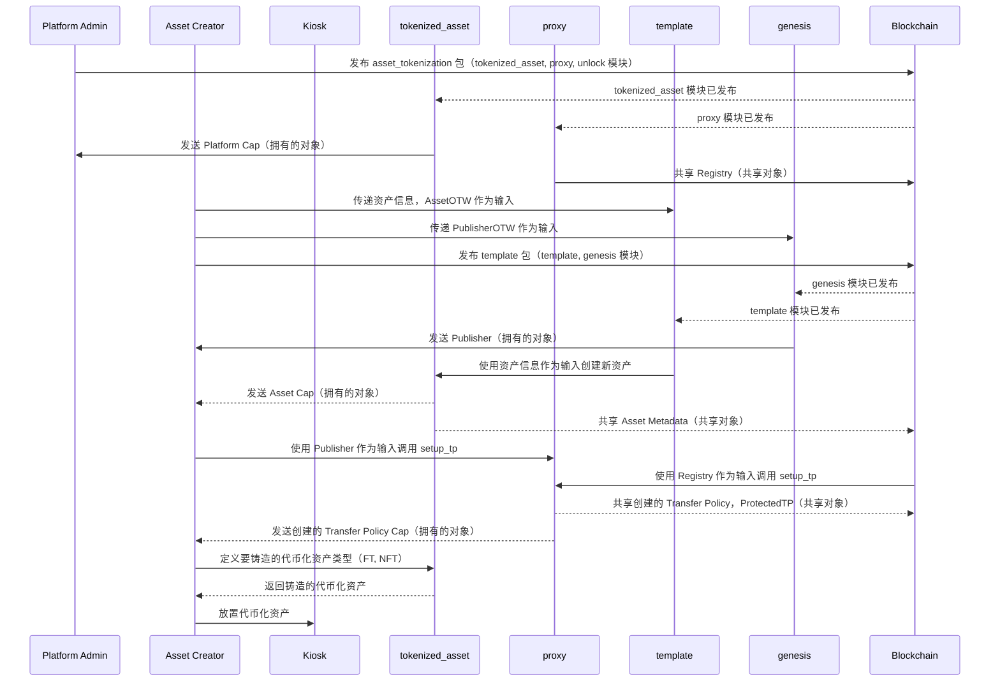
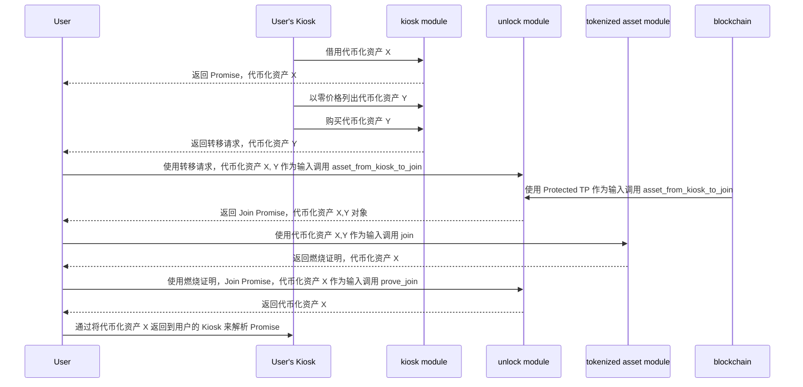
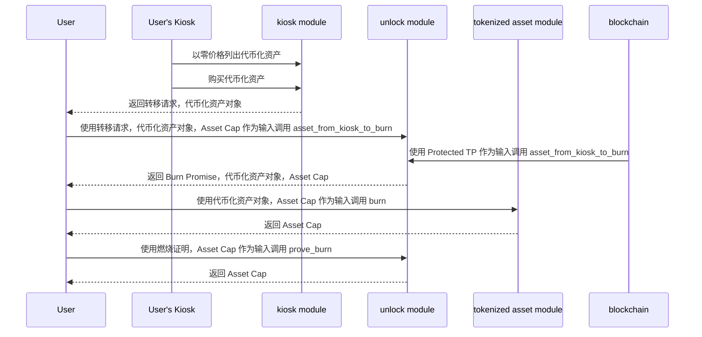

资产通证化是指将现实世界的资产（例如房地产、艺术品、商品、股票或其他有价资产）表示为区块链网络上的数字通证的过程。这涉及将资产的所有权或权利转换为数字通证，然后在区块链上记录和管理。

## 高级概述

这一概念是将高价值资产分割成更小、更简单的单位，每个单位代表资产的所有权或部分。

这种策略使得更多的投资者能够参与，他们可能希望通过投资资产的一部分来降低风险，而不是成为唯一的所有者，从而扩大了对更广泛投资者的可访问性。

这种代币模式类似于 [ERC1155](https://eips.ethereum.org/EIPS/eip-1155) 具有附加功能的多代币标准。 这使其成为在 Sui 上实现 Solidity 基于用例的合适选择。

- **资产创建**

每个资产被分割为一个总供应量，每个部分由非同质化代币（NFT）或同质化代币（FT）类型的收藏品表示。这确保每个单独的部分保持一个等于或大于一的余额，当合并时，所有部分的总和达到资产的总供应量。

除了总供应量，每个资产还由各种其他字段定义，如名称、描述等。这些字段共同构成资产的元数据，并在资产的所有部分中保持一致。

- **NFTs 和 FTs 区别**

每次铸造代币化资产时，都有可能使用新的元数据来创建它。如果纳入了新的元数据，代币化资产将被视为独一无二，从而将其转变为 NFT。在这种情况下，其余额被限制为一个，表示该资产仅存在一个实例。

如果没有额外的元数据，那么标记化的资产将被归类为 FT，允许其余额超过一，从而允许存在该资产的多个相同实例。

FT 具有合并（加入）或拆分的能力，当余额大于一时可以进行拆分。这一功能允许根据需要聚合或划分代币的单位，提供处理不同数量的灵活性。

如前所述，代币化资产的所有收藏品，无论是 NFT 还是 FT，当合并时，总和可以达到资产的最大总供应量。

- **可销毁性**

创建资产时，可以定义资产的部分是否有资格从流通中移除或销毁。移除或销毁资产的过程称为燃烧（burning）。

如果代币化资产是可销毁的，那么销毁一部分代币会导致流通供应量减少，减少量等于销毁物品的余额。但总供应量保持不变，因此您可以在需要时再次铸造已销毁的部分，从而维持资产的预定总供应量。

## Move packages

与 Sui 上的所有智能合约一样，Move 提供了支持资产代币化的逻辑。

### asset_tokenization package

:::info

此实例参考实现使用 [Kiosk standard](../../../standards/kiosk.mdx) 确保代币化资产在其定义的逻辑内运作。按照示例操作，可以拥有支持诸如版税、佣金等规则的可销售代币化资产。

如果不需要使用 Kiosk，则可以排除 unlock 模块和与转移策略相关的一些代理方法。

:::

选择一个模块查看其详细信息：

<Tabs groupId="modules">

<TabItem label="tokenized_asset" value="tokenized_asset">

`tokenized_asset` 模块的运作方式类似于`coin `库

当它接收到一个新的[one-time witness](concepts/sui-move-concepts/one-time-witness.mdx) 类型时, 它会创建一个数字化资产的独特表示。 该模块采用与 Coin 模块中某些方法类似的实现。它包含与资产代币化相关的功能，包括新资产创建、铸造、拆分、合并和燃烧。

**结构**

- `AssetCap`

  为每个新的数字化 NFT 表示的资产生成一个 `AssetCap`。在大多数情况下，您应该将其创建为一个拥有的对象，然后可以将其转移给平台的管理者，以便访问受限的方法调用。

  ```rust
  struct AssetCap<phantom T> {
    id: UID,
    // 当前流通中的供应量
    supply: Supply<T>,
    // 任何时候允许存在的总最大供应量
    total_supply: u64,
    // 决定资产是否可以被燃烧
    burnable: bool
  }

  ```

- `AssetMetadata`

  `AssetMetadata`结构定义了表示要细分的整个资产的元数据，这应该是一个共享对象。

  ```rust
  struct AssetMetadata<phantom T> has key, store {
        id: UID,
        /// 资产名称
        name: String,
        // 任何时候允许存在的总最大供应量
        total_supply: u64,
        /// 资产符号
        symbol: ascii::String,
        /// 资产描述
        description: String,
        /// 资产标志的 URL
        icon_url: Option<Url>
    }

  ```

- `TokenizedAsset`

  `TokenizedAsset` 以指定的余额铸造，该余额小于或等于剩余供应量。如果资产的 VecMap 被填充了值，表示多个独特条目，则被视为 NFT。相反，如果资产的 VecMap 未被填充，表示缺少单独条目，则被视为 FT。

  ```rust
  struct TokenizedAsset<phantom T> has key, store {
        id: UID,
        /// 代币化资产的余额
        balance: Balance<T>,
        /// 如果 VecMap 被填充，则被视为 NFT，否则资产被视为 FT。
        metadata: VecMap<String, String>,
        /// 资产图像的 URL（可选）
        image_url: Option<Url>,
    }
  ```

- `PlatformCap`

  PlatformCap 是指向部署合约的个人颁发的能力。该能力授予与平台功能相关的特定权限或授权，允许部署者在部署的合约中执行某些受控操作或访问权限。

  ```rust
  struct PlatformCap has key, store { id: UID }
  ```

**函数部分**

- `init`

  此函数创建一个 `PlatformCap `并将其发送给发送者。

  ```rust
  fun init(ctx: &mut TxContext) {}
  ```

- `new_asset`

此函数负责创建资产的新表示，定义其关键属性。执行后，它返回两个不同的对象：AssetCap 和 AssetMetadata。这些对象封装了在系统内定义资产所需的信息和特性。

```rust
public fun new_asset<T: drop>(
        witness: T,
        total_supply: u64,
        symbol: ascii::String,
        name: String,
        description: String,
        icon_url: Option<Url>,
        burnable: bool,
        ctx: &mut TxContext
    ): (AssetCap<T>, AssetMetadata<T>) {}
```

- `mint`

该函数执行代币化资产的铸造。如果在此过程中引入了新的元数据，生成的代币化资产被视为独特的，导致创建一个余额为 1 的 NFT。否则，如果没有添加新的元数据，代币化资产被分类为 FT，允许其余额超过 1，具体取决于提供的参数。执行后，函数返回代币化资产对象。

```rust
public fun mint<T>(
        cap: &mut AssetCap<T>,
        keys: vector<String>,
        values: vector<String>,
        value: u64,
        ctx: &mut TxContext
    ): TokenizedAsset<T> {}
```

- `split`

  此函数提供一个 FT 类型的代币化资产和大于 1 的余额，以及一个小于对象余额的值，并对代币化资产执行拆分操作。该操作将现有的代币化资产分成两个单独的代币化资产。新创建的代币化资产的余额等于给定值，而提供对象的余额减少指定值。完成后，该函数返回新创建的代币化资产。此函数不接受或操作 NFT 类型的代币化资产。

  ```rust
  public fun split<T>(
          self: &mut TokenizedAsset<T>,
          split_amount: u64,
          ctx: &mut TxContext
      ): TokenizedAsset<T> {}
  ```

- `join`

该函数被赋予两个 FT 类型的代币化资产，并对代币化资产执行合并操作。该操作涉及将第一个代币化资产的余额增加第二个代币化资产的余额。随后，第二个代币化资产被销毁或从流通中移除。该过程结束后，该函数返回已销毁的代币化资产的 ID。

该函数不接受或操作 NFT 类型的代币化资产。

```rust
public fun join<T>(
        self: &mut TokenizedAsset<T>,
        other: TokenizedAsset<T>
    ): ID {}
```

- `burn`

此函数需要 assetCap 作为参数，从而仅限制平台管理者调用。此外，它还接受一个作为操作一部分被燃烧的代币化资产。燃烧提供的代币化资产后，流通供应量减少被燃烧物品的余额。它需要一个可燃烧的代币化资产。

```rust
public fun burn<T>(
        cap: &mut AssetCap<T>,
        tokenized_asset: TokenizedAsset<T>
    )
```

- `total_supply`

此函数检索并返回代表资产总供应量的值。

```rust
public fun total_supply<T>(cap: &AssetCap<T>): u64 {}
```

- `supply`

此函数检索并返回代表资产当前流通供应量的值。

```rust
public fun supply<T>(cap: &AssetCap<T>): u64 {}
```

- `value`

此函数接受一个代币化资产作为输入并检索其相关的余额值。

```rust
public fun value<T>(tokenized_asset: &TokenizedAsset<T>): u64 {}
```

- `create_vec_map_from_arrays`

  此内部辅助函数填充 VecMap<String, String>。它在填充或设置 VecMap 数据结构内的键值对过程中提供帮助。

  ```rust
  fun create_vec_map_from_arrays(
          keys: vector<String>,
          values: vector<String>
      ): VecMap<String, String> {}
  ```

</TabItem>

<TabItem label="proxy" value="proxy">

`proxy `模块包含类型所有者用于执行发布者相关操作的方法。

**Structs**

- `Proxy`

  `PROXY `结构体表示获取发布者的一个一次性见证（OTW）。

  ```rust
  struct PROXY has drop {}
  ```

- `Registry`

此共享对象充当“发布者”对象的存储库，专门用于控制和限制对代币化资产转移政策的创建和管理的访问。此对象的可变访问权限仅授予实际发布者。

```rust
struct Registry has key {
        id: UID,
        publisher: Publisher
    }
```

- `ProtectedTP`

  这是一个共享对象，存储一个空的转移策略。需要为用户生成的每个类型` <T>` 创建一个。它在 unlock 模块中有所体现。

  ```rust
  struct ProtectedTP<phantom T> has key, store {
          id: UID,
          policy_cap: TransferPolicyCap<T>,
          transfer_policy: TransferPolicy<T>
      }
  ```

**函数**

- `init`

此函数负责创建 Publisher 对象，将其封装在注册表中，并随后共享 Registry 对象。

```rust
fun init(otw: PROXY, ctx: &mut TxContext) {}
```

- `setup_tp`

  此函数利用注册表中嵌套的发布者和发送者的发布者。它生成并返回针对`TokenizedAsset<T>`的转移策略及其相关的转移策略能力。这种类型的 T 来源于 Publisher 对象。

它还生成一个包裹在 `ProtectedTP<T> `对象中的空转移策略，可共享。在特定条件下，您可以使用此功能来覆盖 `kiosk` 锁定规则。

```rust
public fun setup_tp<T: drop>(
        registry: &Registry,
        publisher: &Publisher,
        ctx: &mut TxContext
    ): (TransferPolicy<TokenizedAsset<T>>,
        TransferPolicyCap<TokenizedAsset<T>>) {}
```

- `new_display`

此函数利用注册表中嵌套的发布者和发送者的发布者，为 `TokenizedAsset<T> `类型生成并返回一个空的 `Display`，其中 T 包含在` Publisher` 对象中。

```rust
public fun new_display<T: drop>(
        registry: &Registry,
        publisher: &Publisher,
        ctx: &mut TxContext
    ): Display<TokenizedAsset<T>> {}
```

- `transfer_policy`

  此函数，提供了 `protectedTP`，返回专门为 `TokenizedAsset<T> `类型设计的转移策略。

  ```rust
  public(friend) fun transfer_policy<T>(
          protected_tp: &ProtectedTP<T>
      ): &TransferPolicy<T> {}

  ```

- `publisher_mut`

此函数只能由平台能力的所有者访问。它需要注册表作为参数，以获取发布者的可变引用。

```rust
public fun publisher_mut(
    _: &PlatformCap,
    registry: &mut Registry
): &mut Publisher {}
```

</TabItem>

<TabItem label="unlock" value="unlock">

`unlock` 模块专门用于授权燃烧和合并操作的代币化资产的解锁。

它允许代币化资产类型的创建者为 kiosk 资产启用这些操作，而无需遵守默认的一组要求，如规则或策略。

**结构体**

- `JoinPromise`

  建立一个 promise 对象，以防止试图超出合并预期范围永久解锁对象。

  ```rust
  struct JoinPromise {
    /// 燃烧的代币化资产的余额将添加到的项目
    item: ID,
    /// 被燃烧的代币化资产的 ID
    burned: ID,
    /// 合并后项目的预期最终余额
    expected_balance: u64
  }

  ```

- `BurnPromise`

  创建一个 promise 对象，以确保指定对象的燃烧。

  ```rust
  struct BurnPromise {

  expected_supply: u64

  }

  ```

**函数**

- `asset_from_kiosk_to_join`

  此辅助函数旨在促进在`kiosk`中锁定的代币化资产的合并。它有助于解锁设置为燃烧的代币化资产，并确保另一个相同类型的代币化资产最终包含其余额，通过返回 `JoinPromise `实现。

  ```rust
  public fun asset_from_kiosk_to_join<T>(
    self: &TokenizedAsset<T>, // A
    to_burn: &TokenizedAsset<T>, // B
    protected_tp: &ProtectedTP<TokenizedAsset<T>>, // unlocker
    transfer_request: TransferRequest<TokenizedAsset<T>> // transfer request for b
  ): JoinPromise {}
  ```

- `prove_join`

  一个用于证明已成功燃烧解锁的代币化资产并将其余额合并到现有代币化资产中的函数。

  ```rust
  public fun prove_join<T>(
    self: &TokenizedAsset<T>,
    promise: JoinPromise,
    proof: ID) {
  }
  ```

- `asset_from_kiosk_to_burn`

  辅助函数，促进在 kiosk 中锁定的代币化资产的燃烧。它有助于解锁它们，同时确保通过返回 BurnPromise 流通供应量将被减少。

  ```rust
  public fun asset_from_kiosk_to_burn<T>(
      to_burn: &TokenizedAsset<T>,
      asset_cap: &AssetCap<T>,
      protected_tp: &ProtectedTP<TokenizedAsset<T>>,
      transfer_request: TransferRequest<TokenizedAsset<T>>,
    ): BurnPromise {
  }
  ```

- `prove_burn`

  确保资产能力的流通供应量减少被燃烧的代币化资产的余额。

  ```rust
  public fun prove_burn<T>(
    asset_cap: &AssetCap<T>,
    promise: BurnPromise) {
  }
  ```

</TabItem>

</Tabs>

### 模板包

一个示例用例包，利用 Rust WASM 功能支持在浏览器上无缝创建资产。

这类似于 launchpad 方法，并作为模板包用于每当需要将新资产表示为代币化资产时。

有效地允许用户实时编辑此模板合约的字段并发布包含编辑内容的合约。
此包实现了两个基本模块，每个模块满足资产代币化所需的不同功能。有关如何实现 Rust WASM 的更多详细信息，请参见 [Web Assembly](#webassembly-wasm-and-template-package) 部分.

- **模块**

  - `template`

    这是支持定义新资产的模块。

    当您需要将新资产表示为数字化资产时，请将此模块修改为 `<template>::<TEMPLATE>`，其中` <template>`（大写）是此新资产的` OTW`。

    此模块调用 `asset_tokenization::tokenized_asset::new_asset(...)`方法，促进资产新字段的声明：

    - `witness`: OTW `NEW_ASSET`
    - `total_supply`: 总供应量
    - `symbol`: 资产符号
    - `name`: 资产名称
    - `description`: 资产描述
    - `icon_url`: 资产标志的 URL（可选）
    - `burnable`: 定义资产是否可由管理员燃烧的布尔值

  - `genesis`

  一个包含 OTW 的 genesis 类型模块，以便发送者可以声明发布者。

### 发布和铸造代币化的序列图



### 合并序列图

以下序列图展示了合并流程的进行。假设以下流程：

- 代币化资产 X 和 Y 已由其类型的创建者铸造。
- 代币化资产 X 和 Y 已放置并锁定在用户的 kiosk 中。
- 所有操作都在同一个可编程交易块（PTB）中执行。



### 燃烧序列图

以下序列图展示了燃烧流程：

- 代币化资产已由其类型的创建者铸造。
- 代币化资产已放置并锁定在用户的 kiosk 中。
- 所有操作都在同一个 PTB 中执行。



## 修改

所提供的包和模块展示了如何为您的项目实现资产代币化。您的特定用例可能需要修改合约以方便或引入新功能。

### 示例修改

而不是在 PTB 内部以多个步骤实现 unlock 功能，还可以创建一个在一个函数中执行购买、借用、解锁和合并资产的方法。以下是该合并操作的示例：

```rust
public fun kiosk_join<T>(
	kiosk: &mut Kiosk,
  kiosk_cap: &KioskOwnerCap,
	protected_tp: &ProtectedTP<TokenizedAsset<T>>,
  ta1_id: ID,
  ta2_id: ID,
  ctx: &mut TxContext
) {

	kiosk::list<TokenizedAsset<T>>(kiosk, kiosk_cap, ta2_id, 0);
	let (ta1, promise_ta1) = kiosk::borrow_val(kiosk, kiosk_cap, ta1_id);
	let coin = coin::zero<SUI>(ctx);
	let (ta2, request) = kiosk::purchase(kiosk, ta2_id, coin);

	let tp_ref = proxy::transfer_policy(protected_tp);
	let (_item, _paid, _from) = transfer_policy::confirm_request(
	    tp_ref,
	    request
	);

	tokenized_asset::join(&mut ta1, ta2);

	kiosk::return_val(kiosk, ta1, promise_ta1);
}
```

### 用例示例修改

:::caution

以下示例`AssetCap<T>`拆分（实际上替换）为两个新对象：`Treasury<T> `和 `AdminCap<T>`。对原始包中定义的方法的访问，现在需要谨慎重新设计，因为此更改可能引入不必要的效果。此示例中的重新设计并不完全包含，仅对某些方法进行了更改以进行演示（或作为全面练习）。

:::

假设您希望允许用户也可以燃烧资产，而不仅仅是管理员。这仍然需要是一个授权操作，但它将允许在特定用例中消耗代币化资产的灵活性（例如，燃烧您收集的所有收藏品以将它们合并）。为了实现这一点，管理员可以铸造包含允许其燃烧的资产 ID 的票券。要支持此功能，您必须重新设计智能合约并将管理员与每个资产的资金库分开，现在资金库仅保存与供应相关的信息。需要进行的示例更改如下：

**结构体**

创建一个仅具有 key 能力的票券，使接收者无法交易它。

```rust
struct BurnTicket<phantom T> has key {
	id: UID,
	tokenized_asset_id: ID // the tokenized asset that this ticket gives access to burn
}
```

现在仅保存资金库相关信息（拆分 `AssetCap` 的结果，这意味着它不再是此设计的一部分）的结构体作为共享对象创建。将 `mint `等函数更改为也接受 `Treasury` 对象和`AdminCap`对象作为输入。

```rust
struct Treasury<phantom T> has key, store {
	id: UID,
	supply: Supply<T>,
  total_supply: u64,
}
```

`AssetCap `功能的另一半，保留管理员能力和可燃烧性配置的是发送给类型`<T>`创建者的拥有对象。

```rust
struct AdminCap<phantom T> has key, store {
	id: UID,
	burnable: bool
}
```

**方法签名**

`AdminCap` 在这里充当管理员能力和类型保险。它编码了允许使用此票券删除的资产类型的信息。
此函数应断言资产 `T `是可燃烧的，并返回一个` BurnTicket<T>`。

```rust
public fun mint_burn_ticket<T>(
	cap: &AdminCap<T>,
	tokenized_asset_id: ID,
	ctx: &mut TxContext
): BurnTicket
```

用户端的燃烧需要他们访问共享的 `Treasury `对象。此函数燃烧代币化资产并减少供应量。

```rust
public fun burn_with_ticket<T>(
	treasury: &mut Treasury<T>,
	self: TokenizedAsset<T>,
	ticket: BurnTicket<T>)
```

# 部署

{@include: ../../../snippets/initialize-sui-client-cli.mdx}

## 发布

此阶段，您可以选择手动部署合约或使用自动部署的发布 bash 脚本，该脚本自动部署合约并为您设置大部分与 .env 资产代币化相关的字段。

.env.template 文件表示脚本自动填写的变量。

您可以在此处查看参考：

```
SUI_NETWORK = rpc endpoint of the network of your choice | auto filled by publish script
ASSET_TOKENIZATION_PACKAGE_ID = Created by publishing `asset_tokenization` package | auto filled by publish script
REGISTRY = Created by publishing `asset_tokenization` package | auto filled by publish script

TEMPLATE_PACKAGE_ID = Created by publishing `template` package
ASSET_CAP_ID = Created by publishing `template` package
ASSET_METADATA_ID = Created by publishing `template` package
ASSET_PUBLISHER = Created by publishing `template` package

PROTECTED_TP = Created by calling `setup_tp` function
TRANSFER_POLICY = Created by calling `setup_tp` function

OWNER_MNEMONIC_PHRASE = your mnemonic | can be exported locally in the terminal before publishing
BUYER_MNEMONIC_PHRASE = buyer's mnemonic | can be exported locally in the terminal before publishing
TARGET_KIOSK = kiosk id
BUYER_KIOSK = kiosk id


TOKENIZED_ASSET = tokenized asset id (created by minting)
FT1 = tokenized asset id (to be joined)
FT2 = tokenized asset id (to be joined)
```

有关发布的更多详细信息，请参阅 setup 文件夹的[README](https://github.com/MystenLabs/asset-tokenization/tree/main/setup).

### 发布包

选择一个包来获取具体说明。

:::tip
从 `Sui v1.24.1 `版本开始，CLI 命令不再需要 `--gas-budget` 标志。
:::

<Tabs>

<TabItem label="asset_tokenization" value="asset_tokenization">

### 手动发布

在项目的 move/asset_tokenization 目录下的终端或控制台中输入：

```bash
sui client publish --gas-budget <GAS-BUDGET>
```

对于 gas 预算，使用标准值如 20000000。

包应成功部署，然后您将看到：

```bash
UPDATING GIT DEPENDENCY https://github.com/MystenLabs/sui.git
INCLUDING DEPENDENCY Sui
INCLUDING DEPENDENCY MoveStdlib
BUILDING asset_tokenization
Successfully verified dependencies on-chain against source.
```

您可以查看大量信息和交易效果。

您应选择并存储创建对象中的 package ID 和 registry ID，并将其存储在 .env 文件中的相应字段中。

之后，有必要修改 `Move.toml` 文件。在` [addresses]` 部分下，将`0x0`替换为相同的 `package ID`。可选地，在 `[package] `部分下，添加 `published-at = <package ID>`（如果在运行 `sui client publish` 后看到 `Move.lock` 文件，则不需要此步骤）

### 自动发布

自动填写的字段包括：SUI_NETWORK、ASSET_TOKENIZATION_PACKAGE_ID 和 REGISTRY

要使用 bash 脚本发布，请运行：

```bash
npm run publish-asset-tokenization
```

发布后，您现在可以像手动流程中描述的那样编辑 Move.toml 文件。

有关此过程的更多详细信息，请参阅 setup 文件夹的[README](https://github.com/MystenLabs/asset-tokenization/tree/main/setup).

</TabItem>

<TabItem label="template" value="template">

### 手动发布

在项目的 move/template 目录下的终端或控制台中输入：

```bash
sui client publish --gas-budget <GAS-BUDGET>
```

对于 gas 预算，使用标准值如 `20000000`。

包应成功部署，然后您将看到：

```bash
UPDATING GIT DEPENDENCY https://github.com/MystenLabs/sui.git
INCLUDING DEPENDENCY asset_tokenization
INCLUDING DEPENDENCY Sui
INCLUDING DEPENDENCY MoveStdlib
BUILDING template
Successfully verified dependencies on-chain against source.
```

您依然可以查看大量信息和交易效果。

您应选择并存储创建对象中的 package ID、资产 metadata ID、asset cap ID 和 Publisher ID，并将其存储在 .env 文件中的相应字段中。

### 自动发布

自动部署 template 包的过程指的是通过 WASM 库发布新资产。快速入门步骤：

- 确保 asset_tokenization 包地址设置在 asset_tokenization/Move.toml 的 [addresses] 部分。这一地址应与原始包部署相同。
- 如果在运行 sui client publish 后存在 Move.lock 文件，则继续下一步。如果没有，请确保 asset_tokenization/Move.toml 文件的 published-at 字段已取消注释并填充了最新包部署的地址。
- 通过更改 publishNewAsset 函数的输入参数，对模板字段进行任何更改。
- 运行 npm run publish-template。
- 选择并存储创建对象中的 Template Package ID、asset metadata ID、asset cap ID 和 publisher ID，并将其存储在您的 .env 文件中的相应字段中。

有关此过程的更多详细信息，请参阅 setup 文件夹的[README](https://github.com/MystenLabs/asset-tokenization/tree/main/setup)。

</TabItem>

</Tabs>

## WebAssembly (WASM) and template package {#webassembly-wasm-and-template-package}

:::tip

您可以在[move-binary-format-wasm](https://github.com/MystenLabs/sui/tree/main/sdk/move-binary-format-wasm)，Sui 仓库子文件夹中找到 WASM 库的公开参考。

:::

此功能的开发目的是在网页上启用 Move 字节码的序列化和反序列化。实质上，此功能允许您在网页环境中编辑现有合约。

在资产代币化的情况下，这些编辑允许您创建和发布新类型，代表我们希望代币化的物理或数字资产。

### 字节码操作 {#bytecode-manipulation}

:::caution

对模板包所做的修改需要重复此过程。请注意，一些修改，例如更改常量名称，不会影响生成的字节码。

:::

在继续如何进行这些编辑之前，了解库如何暴露模板模块字节码非常重要。该过程目前是手动的。这需要您构建并检索编译后的字节码。为此，请导航到模板文件夹并运行以下命令：

```bash
xxd -c 0 -p build/template/bytecode_modules/template.mv | head -n 1
```

<details>
  <summary>
  响应
  </summary>

您应收到的响应类似于以下内容：

```bash
a11ceb0b060000000a010010021026033637046d0a05776807df01ec0108cb03800106cb043
e0a8905050c8e0549001303140107010d01120215021602170004020001000c01000101010c
010001020307000302070100000403070006050200070607000009000100010a0a0b0102021
2050700030c010401000311060401000418050800050e0601010c050f1001010c06100d0e00
070b050300030304030109060c070f02080007080600040b040108070b010108000b0201080
00b04010807010807010b04010900010a020109000108030108050108000809000308030805
08050b0401080701070806020b010109000b02010900010b02010800010608060105010b010
10800020900050841737365744361700d41737365744d65746164617461064f7074696f6e06
537472696e670854454d504c415445095478436f6e746578740355726c0561736369690b647
56d6d795f6669656c6404696e6974096e65775f6173736574156e65775f756e736166655f66
726f6d5f6279746573046e6f6e65066f7074696f6e137075626c69635f73686172655f6f626
a6563740f7075626c69635f7472616e736665720673656e64657204736f6d6506737472696e
670874656d706c6174650f746f6b656e697a65645f6173736574087472616e736665720a747
85f636f6e746578740375726c04757466380000000000000000000000000000000000000000
000000000000000000000000000000000000000000000000000000000000000000000000000
000000000000100000000000000000000000000000000000000000000000000000000000000
02d9ebdef1e3cb5eb135362572b18faeb61259afe651a463f1384745ebd7fd51da030864000
000000000000a02070653796d626f6c0a0205044e616d650a020c0b4465736372697074696f
6e0a02090869636f6e5f75726c0101010a02010000020108010000000002230704070621040
738000c02050b0704110938010c020b020c050b0007000701110207021105070311050b0507
050a0138020c040c030b0438030b030b012e110838040200
```

</details>

复制您收到的输出并将其粘贴到位于[bytecode-template.ts](https://github.com/MystenLabs/asset-tokenization/blob/main/setup/src/utils/bytecode-template.ts)文件中 `getBytecode`方法的返回指令中

此外，因为 `template `包包含两个模块，因此还有另一个依赖项，您还需要以类似的方式检索 `genesis `模块的字节码。这个模块的字节码，然而，并未被编辑，并按原样使用。此操作与`WASM`库不直接相关，但对于成功部署编辑后的 `template` 模块是必要的。要获取` genesis` 的字节码，请导航到` template` 文件夹并运行：

```bash
xxd -c 0 -p build/template/bytecode_modules/genesis.mv | head -n 1
```

输出格式类似于模板模块，但长度较短。与模板模块一样，您需要复制此输出，但这次将其粘贴到 [genesis_bytecode.ts](https://github.com/MystenLabs/asset-tokenization/blob/main/setup/src/utils/genesis_bytecode.ts)文件中的字节码常量变量中。

完成上述设置后，库现在可以通过反序列化、编辑和重新序列化字节码来操纵字节码，以便您可以发布它。

### template 模块的详细视图

查看 template 模块，您应该看到定义了几个常量：

```rust
...
const TOTAL_SUPPLY: u64 = 100;
const SYMBOL: vector<u8> = b"Symbol";
const NAME: vector<u8> = b"Name";
const DESCRIPTION: vector<u8> = b"Description";
const ICON_URL: vector<u8> = b"icon_url";
const BURNABLE: bool = true;
...
```

这些常量作为 WASM 库能够修改的参考点。如果查看执行编辑和部署的 TypeScript 代码，您可以看到这些字段是如何被识别和更新的：

```tsx
...
const template = getBytecode();

const compiledModule = new CompiledModule(
  JSON.parse(wasm.deserialize(template))
)
  .updateConstant(0, totalSupply, "100", "u64")
  .updateConstant(1, symbol, "Symbol", "string")
  .updateConstant(2, asset_name, "Name", "string")
  .updateConstant(3, description, "Description", "string")
  .updateConstant(4, iconUrl, "icon_url", "string")
  .updateConstant(5, burnable, "true", "bool")
  .changeIdentifiers({
    template: moduleName,
    TEMPLATE: moduleName.toUpperCase(),
  });

const bytesToPublish = wasm.serialize(JSON.stringify(compiledModule));
...
```

查看 updateConstant 方法，用于更新常量。此方法接受四个参数：

- idx（索引），声明的常量在常量池中的位置。顺序是连续的，从 Move 文件中定义的第一个常量的 0 开始，每个连续的常量加一。
- value，包含您要更改的常量的更新值。
- expectedValue，包含常量当前的值。
- expectedType，包含常量当前的类型。
  最后两个参数是必需的，以最大限度地减少意外更新错误常量的风险，因为该库直接操纵已编译的字节码，这相当危险。

此外，changeIdentifiers 方法更新标识符，在我们的情况下是模块名称和结构体名称。此方法接受一个 JSON 对象作为参数，键是模块中当前的标识符名称，值是您希望更改为的所需名称。

最后，要部署更改后的 template 模块，构建并发布：

```tsx
...
const tx = new Transaction();
  tx.setGasBudget(100000000);
  const [upgradeCap] = tx.publish({
    modules: [[...fromHEX(bytesToPublish)], [...fromHEX(genesis_bytecode)]],
    dependencies: [
      normalizeSuiObjectId("0x1"),
      normalizeSuiObjectId("0x2"),
      normalizeSuiObjectId(packageId),
    ],
  });

  tx.transferObjects(
    [upgradeCap],
    tx.pure(signer.getPublicKey().toSuiAddress(), "address")
  );
...
```

如在 [字节码操作](#bytecode-manipulation) 部分所述，需要发布的模块是 template 和 genesis，因此 modules 数组中有两个元素。还需要包括 Move.toml 文件中涉及包定义的任何依赖项。之前使用的 packageId 是 asset_tokenization 包部署到的地址。

## TypeScript

现在，您可以开始与已部署的智能合约和您的代币化资产进行交互。

在项目的 setup 目录中的终端或控制台中，使用以下命令：

- **Create Transfer Policy**

  首先，创建一个 `TransferPolicy` 和一个 `ProtectedTP`，使用以下命令：

  ```shell
  npm run call create-tp
  ```

  执行命令后，控制台会显示交易的效果。

  通过在 Sui 网络浏览器上搜索交易摘要，您可以找到创建的对象。随后，从这些对象中选择并保存 `TransferPolicy ID `和 `ProtectedTP ID`，并将其存储在您的`.env`文件中的相应字段中。

- **Add Rules**

  在项目的 `setup/src/functions` 目录中的` transferPolicyRules.ts` 文件中，您可以修改代码以包含所需的转移策略规则。

  需要修改的代码片段：

  ```rust
  // A demonstration of using all the available rule add/remove functions.
      // You can chain these commands.
      tpTx
          .addFloorPriceRule('1000')
          .addLockRule()
          .addRoyaltyRule(percentageToBasisPoints(10), 0)
          // .addPersonalKioskRule()
          // .removeFloorPriceRule()
          // .removeLockRule()
          // .removeRoyaltyRule()
          // .removePersonalKioskRule()
  ```

  通过运行命令 `npm run call tp-rules`，规则将被添加到您的转移策略中。

  现在，投资者可以根据您设置的规则交易您的资产部分。

- **Select Kiosk**
  如果希望拥有可销售的资产，必须将代币化资产放置在`kiosk`中。随后，您可以将它们列出并出售给其他用户。必须锁定对象以防止未来未经授权的使用，超出您设置的定义策略。

  最佳实践建议为所有操作使用一个全面的 `kiosk`。然而，这并不总是如此。因此，本项目要求仅使用一个个人 `kiosk`，以确保一致性和更好的管理，即使您拥有多个 `kiosk`。

  为了执行此规则，执行命令` npm run call select-kiosk`。这将为您提供本项目要使用的特定 `kiosk ID`。

  然后，将提供的` Kiosk ID` 存储在您的 `.env `文件中的适当字段中。

- **Mint**

  在项目的` setup/src/functions` 目录中的 `mint.ts `文件中，您可以编辑代码以铸造所需类型（NFT/FT）和资产的余额。

  如前所述，如果提供了额外的元数据，代币化资产将被视为余额为一的 NFT。然而，如果没有额外的元数据，代币化资产将被视为 FT，您可以选择其余额，可以超过一。

  这是需要修改的代码示例：

  ```rust
  // example without metadata -> FT
  function getVecMapValues() {

    const keys : string[] = [];
    const values : string[] = [];

    return { keys, values };
  }
  ```

  或者

  ```rust
  // example with metadata -> NFT
  function getVecMapValues() {
  	const keys = [
  	  "Piece",
  	  "Is it Amazing?",
  	  "In a scale from 1 to 10, how good?",
    ];
    const values = ["8/100", "Yes", "11"];

    return { keys, values };
  }
  ```

  执行命令 `npm run call mint` 后，将铸造一个新的代币化资产。您可以将对象的`ID`存储在`.env`文件中以供将来参考。

- **Lock**

  将对象锁定在 `kiosk `中对于防止任何超出已建立策略的未经授权的使用至关重要。

  执行命令` npm run call lock` 后，您新铸造的代币化资产将被锁定在您的`kiosk` 中。

  在运行命令之前，请确保您的 `.env` 文件中的 `TOKENIZED_ASSET `字段已填充您打算锁定的对象。

- **Mint and Lock**

  执行命令 `npm run call mint-lock`会按顺序执行铸造和锁定功能，确保铸造的资产被创建并立即锁定在 kiosk 中。

- **List**

  现在，您的代币化资产已放置并锁定在您的` kiosk` 中，您可以继续将其列出以供出售。

  在项目的 `setup/src/functions` 目录中的`listItem.ts `文件中，您可以调整代码以指定要列出的资产。

需要修改的代码片段：

```rust
const SALE_PRICE = '100000';
  kioskTx
    .list({
        itemId,
        itemType,
        price: SALE_PRICE,
    })
    .finalize();
```

通过运行命令 `npm run call list`，您的代币化资产将被列出并可供出售。

- **Purchase**

  当用户打算购买某个项目时，需要将其列出出售。在用户选择要购买的项目后，他们需要修改位于` setup/src/functions` 目录中的` purchaseItem.ts` 文件中的以下代码片段。

```rust
const item = {
    itemType: tokenizedAssetType,
    itemId: tokenized_asset ?? tokenizedAssetID,
    price: "100000",
    sellerKiosk: targetKioskId,
};
```

    除了指定项目及其类型外，买家还必须设置特定的价格和卖家的` kiosk ID`，以成功执行购买交易，通过运行 `npm run call purchase `实现。

- **合并**

  执行命令 `npm run call join `时，将合并两个指定的 FT 类型的代币化资产。在运行命令之前，请确保您的 `.env `文件中的 `FT1` 和` FT2`字段已填充您打算合并的对象。

- **燃烧**

  当您打算燃烧一个代币化资产时，执行命令 `npm run call burn`。此操作后，指定的资产将被销毁。在运行命令之前，请确保您的 `.env `文件中的 `TOKENIZED_ASSET `字段已填充您打算燃烧的对象。

- **获取余额**

  通过执行命令 `npm run call get-balance`，您可以检索与指定代币化资产相关联的余额值。

- **获取供应量**

  通过执行命令` npm run call get-supply`，您可以检索代表资产当前流通供应量的值。

- **获取总供应量**

  通过执行命令 `npm run call get-total-supply`，您可以检索代表资产总供应量的值。
