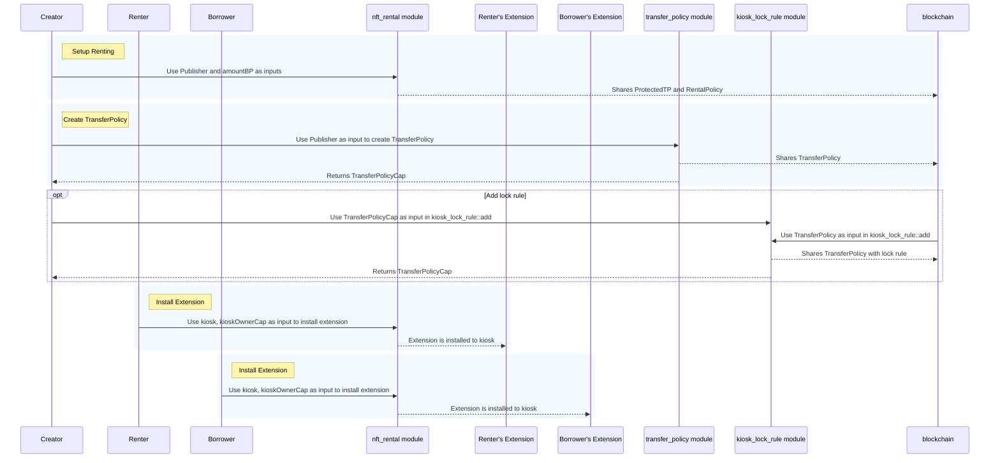
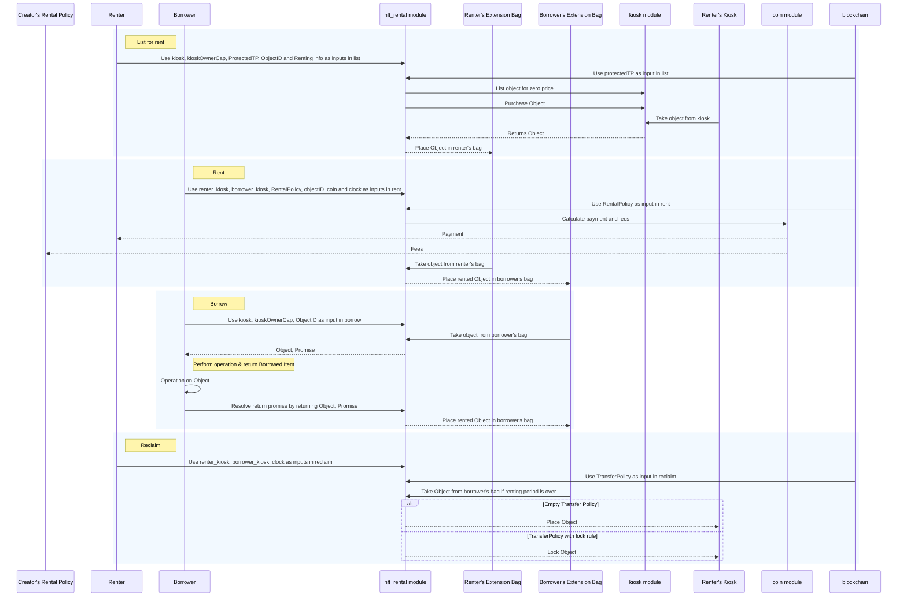
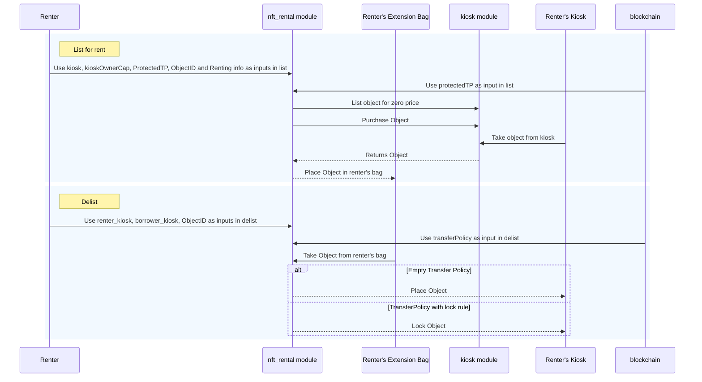

`NFT renting`是一种协议可以使得没有该 NFT 的拥有权的或者持有权的人可以暂时使用或者体验他，该过程的实现是利用了`Kiosk Apps`标准来建立租赁交易的基础设施。
种方法与以太坊的 `ERC-4907` 租赁标准紧密结合，使其成为在 Sui 上实现基于 Solidity 的用例的合适选择

** NFT 租赁示例满足以下需求 **

- 允许出借方在指定时间段内提供其资产进行租赁（列出租赁清单）。
- 允许出借方定义租赁期限。
  - 借用方必须遵守租赁期限。
- 借用方可以获得对 NFT 的可变或不可变访问权限。
  - 不可变访问，为只读。
  - 可变访问，出借方应考虑降级和升级操作，并将其包含在租赁费用中。
- 租赁期结束后，物品可以正常出售。
- 创作者定义的版税通过包含转移策略规则得到尊重。

## 使用案例

现实世界中 NFT 租赁的一些用例：

- [游戏](#游戏方面)
- [票务](#票务)
- [虚拟土地](#虚拟土地)
- [临时资产和订阅](#临时资产和订阅)

### 游戏

在游戏中，租赁 NFT 可以提升用户体验的多个方面：

- **游戏内部资产：** NFT 可以代表独特的游戏内物品、角色、皮肤或配饰。玩家可以安全地租赁这些资产。
- **所有权和真实性：**NFT 提供了透明且不可更改的所有权记录，确保真正拥有游戏内物品的玩家可以租赁它们，并在租赁期结束后收回物品。这可以打击欺诈和伪造问题。
- **跨游戏集成：**租赁 NFT 可以跨多个游戏使用，允许玩家将其独特的物品或角色从一个游戏租赁到另一个游戏，促进互操作性。
- **游戏收藏品：**NFT 可以代表游戏内的数字收藏品，创建一个数字资产生态系统，玩家可以租赁独特的物品。

### 票务

在票务领域，NFT 在提升可转移性方面起到了关键作用。
这些数字资产促进了票据的安全和可追溯转移、转售或租赁，降低了二级市场中假票的风险。
基于区块链的 NFT 确保了每笔交易的透明度和真实性，为用户提供了一种可靠且抗欺诈的方式参与与票务相关的活动。
这一创新不仅简化了票据持有者的流程，还促成了一个更加可信和高效的二级票务市场。

### 虚拟土地

在元宇宙中租赁虚拟土地和办公室为企业提供了灵活的解决方案，使活动公司能够在不进行永久性收购的情况下举办聚会，并通过虚拟办公室促进远程工作。
这种方法不仅提供了具有成本效益的替代方案，还符合数字商业运营不断发展的动态。

### 临时资产和订阅

临时资产和订阅是租赁 NFT 的显著应用，提供了对高端虚拟赌场或策划的数字时尚等虚拟体验的可访问性。
这些 NFT 满足了不同的预算需求，扩大了受众范围。订阅租赁扩展到数字资产池，允许用户每月支付一定费用以获取一定数量的物品，促进了可访问性、用户留存和获取。
持有者可以出租未使用的订阅，确保他们不会因此而损失，协议获得潜在客户，临时持有者可以进行无承诺的试用。这展示了租赁 NFT 在各种场景中的适应性和以用户为中心的吸引力。

### 智能合约设计

:::warning

在资产租赁期间转移 `Kiosk `可能会导致意外行为。如果你想完全禁止 `Kiosk `的转移，考虑使用个人 `Kiosk`。

:::

租赁智能合约使用 Kiosk Apps 标准。
出借方和借用方必须安装 Kiosk 扩展才能参与，借用资产类型的创建者必须创建租赁策略和 `ProtectedTP `对象，以允许扩展管理租赁，同时执行版税。

:::info
该案例是按天数收取租赁费。您可以重新设计和更新逻辑以支持按小时甚至按秒收费。
:::

## Move 模块

NFT 租赁示例使用一个模块` nft_rental.move`。你可以在 Sui 仓库的 `examples` 目录中找到该文件的[源代码](https://github.com/MystenLabs/sui/tree/main/examples/move/nft-rental/sources/nft_rental.move)。源代码包含详细的注释，帮助你理解示例的逻辑和结构。

### 租赁

`nft_rental `模块提供了一个 API，促进以下操作进行出借或借用：

- 列出租赁名单
- 从租赁名单中撤销
- 租赁
- 按参考借入和按价值借入
- 为出借方回收

### 结构

`nft_rental` 模块的对象模型提供了应用程序的结构，从 `Rentables `对象开始。该结构体仅具有 `drop` 能力，作为 `Kiosk Rentables` 扩展的扩展密钥

```move
public struct Rentables has drop {}
```

`Rented` 结构体表示一个被租赁的物品。该结构体仅包含对象的 ID 字段，用作借用者 `Bag `条目中的动态字段键。
当有人正在借用物品时使用。该结构体具有 ` store`、 `copy`和`drop` 能力，因为它们对所有动态字段键都是必要的。

```move
public struct Rented has store, copy, drop { id: ID }
```

`Listed` 结构体表示一个已列出的物品。该结构体仅包含对象的`ID`字段，用作租赁者 `Bag` 条目中的动态字段键。
与`Rented`类似，该结构体具有 `store`、`copy` 和 `drop` 能力，因为它们对所有动态字段键都是必要的。

```move
public struct Listed has store, copy, drop { id: ID }
```

`Promise`结构体用于通过价值进行借用。`Promise` 类似于一个“热土豆”（一个在其模块中只能打包和解包的无能力结构体）操作，只能通过将物品返回到扩展的 `Bag `来解决。
`Promise` 字段缺乏 `store` 能力，因为它不应被包装在其他对象中。它也缺乏 `drop` 能力，因为只有 `return_val `函数可以消耗它。

```move
public struct Promise {
  item: Rented,
  duration: u64,
  start_date: u64,
  price_per_day: u64,
  renter_kiosk: address,
  borrower_kiosk: ID
}
```

`Rentable `结构体是一个包装对象，表示持有正在租赁的资产。
包含与租赁期限、费用和租赁者相关的信息。该结构体需要 `store` 能力，因为它存储一个确定也具有 `store` 的值 `T`。

```move
public struct Rentable<T: key + store> has store {
  object: T,
  /// 提供租赁的总天数。
  duration: u64,
  /// 初始未定义，租赁后更新。
  start_date: Option<u64>,
  price_per_day: u64,
  /// 资产被取出的 Kiosk ID。
  kiosk_id: ID,
}
```

`RentalPolicy `结构是每个创建者创建的共享对象。该结构定义了创建者从每次租金调用中获得的版税。

```move
public struct RentalPolicy<phantom T> has key, store {
  id: UID,
  balance: Balance<SUI>,
  /// 注意：Move 不支持浮点数。
  ///
  /// 如果需要表示浮点数，需要确定所需的精度并使用更大的整数表示。
  ///
  /// 例如，可以使用基点表示百分比：
  /// 10000 基点表示 100%，100 基点表示 1%。
  amount_bp: u64
}
```

`ProtectedTP` 对象是一个共享对象，创作者铸造它来开始租赁。该对象提供对空的 `TransferPolicy` 的授权访问。这部分是因为 Kiosk 对于强制执行版税的项目及其可交易性施加的限制。此外，它允许租赁模块在扩展框架内操作，同时保证处理的资产始终可交易。

需要一个受保护的空转移策略以促进租赁过程，使扩展可以在没有任何附加规则需要解决的情况下转移资产（如锁定规则、忠诚度规则等）。如果创作者想在租赁中强制执行版税，可以使用之前详细介绍的 `RentalPolicy`。

```move
public struct ProtectedTP<phantom T> has key, store {
  id: UID,
  transfer_policy: TransferPolicy<T>,
  policy_cap: TransferPolicyCap<T>
}
```

### 函数签名

NFT 租赁示例包含以下定义项目逻辑的函数。

`install`函数允许在自助服务终端中安装`Rentables`扩展程序。协助租赁流程的一方负责确保用户在其自助服务终端中安装扩展程序

```move
public fun install(
  kiosk: &mut Kiosk,
  cap: &KioskOwnerCap,
  ctx: &mut TxContext
){
  kiosk_extension::add(Rentables {}, kiosk, cap, PERMISSIONS, ctx);
}
```

`remove`函数允许自助服务终端的所有者（且仅限所有者）移除扩展。扩展存储必须为空，交易才能成功。
用户不再借用或租用任何物品后，扩展存储将清空。该`kiosk_extension::remove`功能在执行前执行所有权检查

```move
public fun remove(kiosk: &mut Kiosk, cap: &KioskOwnerCap, _ctx: &mut TxContext){
  kiosk_extension::remove<Rentables>(kiosk, cap);
}
```

`setup_renting`函数为类型 `T` 铸造并共享` ProtectedTP` 和 `RentalPolicy `对象。类型 `T `的发布者是唯一可以执行此操作的实体

```move
public fun setup_renting<T>(publisher: &Publisher, amount_bp: u64, ctx: &mut TxContext) {
  // 创建一个空的 TransferPolicy 并共享一个 ProtectedTP<T> 对象。
  // 这可用于在特定条件下绕过锁定规则。
  // 将 ProtectedTP 存储在 cap 中，无法访问，
  let (transfer_policy, policy_cap) = transfer_policy::new<T>(publisher, ctx);

  let protected_tp = ProtectedTP {
    id: object::new(ctx),
    transfer_policy,
    policy_cap,
  };

  let rental_policy = RentalPolicy<T> {
    id: object::new(ctx),
    balance: balance::zero<SUI>(),
    amount_bp,
  };

  transfer::share_object(protected_tp);
  transfer::share_object(rental_policy);
}
```

`list`函数允许在 `Rentables` 扩展 中列出资产，创建一个以资产 `ID `作为键、`Rentabl`e 包装对象作为值的条目。
需要存在一个 `ProtectedTP` 转移策略，仅类型 T 的创作者可以创建。该函数假设物品已被放置（并可选地锁定）在 `Kiosk `中。

```move
public fun list<T: key + store>(
  kiosk: &mut Kiosk,
  cap: &KioskOwnerCap,
  protected_tp: &ProtectedTP<T>,
  item_id: ID,
  duration: u64,
  price_per_day: u64,
  ctx: &mut TxContext,
) {

  // 如果未安装 Rentables 扩展，则中止。
  assert!(kiosk_extension::is_installed<Rentables>(kiosk), EExtensionNotInstalled);

  // 设置 Kiosk 所有者为交易发送者，以保持元数据字段的最新状态。
  // 这对于确保正确的人接收付款也是至关重要的。
  // 防止在 Kiosk 在用户之间转移但所有者未更新的情况下产生意外结果。
  kiosk.set_owner(cap, ctx);

  // 以零 SUI 列出物品。
  kiosk.list<T>(cap, item_id, 0);

  // 构造一个零币。
  let coin = coin::zero<SUI>(ctx);
  // 以 0 SUI 购买物品。
  let (object, request) = kiosk.purchase<T>(item_id, coin);

  // 使用受保护的空 TransferPolicy 解决 TransferRequest，该 TransferPolicy 仅通过此模块可访问。
  let (_item, _paid, _from) = protected_tp.transfer_policy.confirm_request(request);

  // 将物品与相关的元数据一起包装在 Rentable 结构体中。
  let rentable = Rentable {
    object,
    duration,
    start_date: option::none<u64>(),
    price_per_day,
    kiosk_id: object::id(kiosk),
  };

  // 将 Rentable 作为已列出项放入扩展的 Bag 中（place_in_bag 是在 `nft_rental.move` 文件中定义的辅助方法）。
  place_in_bag<T, Listed>(kiosk, Listed { id: item_id }, rentable);
}
```

`delist` 函数允许租赁者撤销列出物品，只要它当前未被租赁。该函数还将（或锁定，如果存在锁定规则）物品放回所有者的` Kiosk`。
如果不想应用任何版税，应铸造一个空的` TransferPolicy`。如果在某个时点希望强制执行版税，可以随时更新现有的 `TransferPolicy`。

```move
public fun delist<T: key + store>(
  kiosk: &mut Kiosk,
  cap: &KioskOwnerCap,
  transfer_policy: &TransferPolicy<T>,
  item_id: ID,
  _ctx: &mut TxContext,
) {

  // 如果 cap 与 Kiosk 不匹配，则中止。
  assert!(kiosk.has_access(cap), ENotOwner);

  // 从扩展的 Bag 中移除可租赁物品（take_from_bag 是在 `nft_rental.move` 文件中定义的辅助方法）。
  let rentable = take_from_bag<T, Listed>(kiosk, Listed { id: item_id });

  // 解构 Rentable 对象。
  let Rentable {
    object,
    duration: _,
    start_date: _,
    price_per_day: _,
    kiosk_id: _,
  } = rentable;

  // 如果存在锁定规则，则通过重新锁定资产在所有者的 Kiosk 中来尊重锁定规则。
  if (has_rule<T, LockRule>(transfer_policy)) {
    kiosk.lock(cap, transfer_policy, object);
  } else {
    kiosk.place(cap, object);
  };
}
```

`rent` 函数允许租赁一个已列出的` Rentable`。它允许任何人代表其他用户借用物品，前提是他们已安装 `Rentables` 扩展。`rental_policy `定义了作为费用保留并添加到` rental_policy` 余额中的硬币部分。

```move
public fun rent<T: key + store>(
  renter_kiosk: &mut Kiosk,
  borrower_kiosk: &mut Kiosk,
  rental_policy: &mut RentalPolicy<T>,
  item_id: ID,
  mut coin: Coin<SUI>,
  clock: &Clock,
  ctx: &mut TxContext,
) {

  // 如果未安装 Rentables 扩展，则中止。
  assert!(kiosk_extension::is_installed<Rentables>(borrower_kiosk), EExtensionNotInstalled);

  let mut rentable = take_from_bag<T, Listed>(renter_kiosk, Listed { id: item_id });

  // 基于租赁天数计算租赁价格，确保结果可以存储为 u64。
  let max_price_per_day = MAX_VALUE_U64 / rentable.duration;
  assert!(rentable.price_per_day <= max_price_per_day, ETotalPriceOverflow);
  let total_price = rentable.price_per_day * rentable.duration;

  // 仅接受精确的余额进行支付，不找零。
  let coin_value = coin.value();
  assert!(coin_value == total_price, ENotEnoughCoins);

  // 使用给定的基点金额（百分比）计算费用，确保结果适合 64 位无符号整数。
  let mut fees_amount = coin_value as u128;
  fees_amount = fees_amount * (rental_policy.amount_bp as u128);
  fees_amount = fees_amount / (MAX_BASIS_POINTS as u128);

  // 使用给定的基点金额（百分比）计算费用，确保结果适合 64 位无符号整数。
  let fees = coin.split(fees_amount as u64, ctx);

  // 将给定硬币的费用余额与 `RentalPolicy` 余额合并。
  coin::put(&mut rental_policy.balance, fees);
  // 将付款转移给租赁者。
  transfer::public_transfer(coin, renter_kiosk.owner());
  rentable.start_date.fill(clock.timestamp_ms());

  place_in_bag<T, Rented>(borrower_kiosk, Rented { id: item_id }, rentable);
}
```

`borrow` 函数允许借用方通过引用从其 `Bag` 中获取 `Rentable`。

```move
public fun borrow<T: key + store>(
  kiosk: &mut Kiosk,
  cap: &KioskOwnerCap,
  item_id: ID,
  _ctx: &mut TxContext,
): &T {
  // 如果 cap 与 Kiosk 不匹配，则中止。
  assert!(kiosk.has_access(cap), ENotOwner);
  let ext_storage_mut = kiosk_extension::storage_mut(Rentables {}, kiosk);
  let rentable: &Rentable<T> = &ext_storage_mut[Rented { id: item_id }];
  &rentable.object
}
```

`borrow_val` 函数允许借用方通过值临时获取 `Rentable`，并有协议或承诺归还它。`Promise` 存储有关 `Rentable `的所有信息，便于在对象归还时重建 `Rentable`。

```move
public fun borrow_val<T: key + store>(
  kiosk: &mut Kiosk,
  cap: &KioskOwnerCap,
  item_id: ID,
  _ctx: &mut TxContext,
): (T, Promise) {
  // 如果 cap 与 Kiosk 不匹配，则中止。
  assert!(kiosk.has_access(cap), ENotOwner);
  let borrower_kiosk = object::id(kiosk);

  let rentable = take_from_bag<T, Rented>(kiosk, Rented { id: item_id });

  // 构造一个包含 Rentable 元数据的 Promise 结构体。
  let promise = Promise {
    item: Rented { id: item_id },
    duration: rentable.duration,
    start_date: *option::borrow(&rentable.start_date),
    price_per_day: rentable.price_per_day,
    renter_kiosk: rentable.kiosk_id,
    borrower_kiosk
  };

  // 解构 Rentable 并返回 Promise 以及包装的物品 T。
  let Rentable {
    object,
    duration: _,
    start_date: _,
    price_per_day: _,
    kiosk_id: _,
  } = rentable;

  (object, promise)
}
```

`return_val` 函数允许借用方归还借用的物品

```Move
public fun return_val<T: key + store>(
  kiosk: &mut Kiosk,
  object: T,
  promise: Promise,
  _ctx: &mut TxContext,
) {
  assert!(kiosk_extension::is_installed<Rentables>(kiosk), EExtensionNotInstalled);

  let Promise {
    item,
    duration,
    start_date,
    price_per_day,
    renter_kiosk,
    borrower_kiosk,
  } = promise;

  let kiosk_id = object::id(kiosk);
  assert!(kiosk_id == borrower_kiosk, EInvalidKiosk);

  let rentable = Rentable {
    object,
    duration,
    start_date: option::some(start_date),
    price_per_day,
    kiosk_id: renter_kiosk,
  };

  place_in_bag(kiosk, item, rentable);
}
```

## 序列图

:::note
此案例假设每一个创建者作为开始操作创建一个 `TransferPolicy`（即使为空），以便` Rentables` 扩展可以运行。这是调用`setup_renting`方法的附加要求。
:::

### 初始化

初始化过程是流程的一部分，但每个实体只发生一次：

- 对于创作者想要允许租赁的新类型
  - 包含调用 `setup_renting` 并创建带有可选锁定规则的 `TransferPolicy`
- 对于从未使用此框架借用过的借用方
  - 如果用户没有 `Kiosk`，应该为其创建一个
  - 包含在他们的 `Kiosk `中安装扩展
- 对于从未使用此框架租赁过的租赁方
  - 如果用户没有 `Kiosk`，应该为其创建一个
  - 包含在他们的 `Kiosk `中安装扩展



### 列出-出租-借用-回收



### 列入-除名



## 部署

:::info
有关发布包的更详细指南，请参阅 发布包。有关 Sui 客户端命令行界面的完整参考，请参阅 Sui Client CLI。
:::

在发布代码之前，如果尚未初始化 `Sui Client CLI`，你必须首先进行初始化。为此，在项目的根目录下的终端或控制台中输入 `sui client`。如果收到以下响应，请完成剩余的指示：

```shell
Config file ["<FILE-PATH>/.sui/sui_config/client.yaml"] doesn't exist, do you want to connect to a Sui Full node server [y/N]?
```

输入 y 继续。你会收到以下响应：

```shell
Sui Full node server URL (Defaults to Sui Devnet if not specified) :
```

保持空白（按回车）。你会收到以下响应：

```shell
Select key scheme to generate keypair (0 for ed25519, 1 for secp256k1, 2: for secp256r1):
```

选择 0 ，现在你应该已经设置了一个 Sui 地址。

在能够将包发布到 `Testnet` 之前，你需要 `Testnet SUI` 代币。要获取一些，请加入[` Sui Discord`](https://discord.gg/Sui)，完成验证步骤，进入`#testnet-faucet` 频道并输入 `!faucet <WALLET ADDRESS>`。有关将 SUI 添加到 Testnet 账户的其他方式，请参阅获取 SUI 代币。

现在你已经有一个带有一些 Testnet SUI 的账户，可以部署你的合约。要发布你的包，请在同一终端或控制台中使用以下命令：

```shell
sui client publish --gas-budget <GAS-BUDGET>
```

对于 gas 预算，使用一个标准值，例如 20000000。

## 相关链接

- [NFT 租赁示例](https://github.com/MystenLabs/sui/tree/main/examples/move/nft-rental): 此文档引用的源代码。
- [Sui Kiosk](../../../standards/kiosk.mdx): Kiosk 是一个用于 Sui 上商业应用的去中心化系统。
